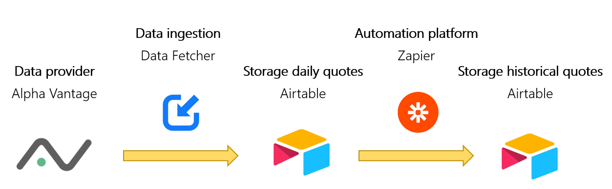

## General information about Airtable
Airtable is a cloud-based collaboration platform that combines the functionality of a spreadsheet with a database. It allows users to create and organize information in customizable tables, making it easy to track, manage, and collaborate on various types of data and projects. In our particular case, it offers the advantage that you don't have to programme anything yourself.

The following figure shows how the process looks for the daily download of data via API.

1. The data is provided by the market data provider [Alpha Vantage](../00-Alpha_Vantage).
2. Using the Airtable add-on application Data Fetcher, the data is extracted from Alpha Vantage and stored in Airtable. This is done automatically on a daily basis.  
3. The first table in Airtable always contains the most recent daily stock data. Whenever there is a change due to a new upload of data, the new data set is loaded into the second table in Airtable via the external tool Zapier.
4. In this way, the data is collected and cumulated to provide a history of the respective shares. 

  

### Running costs

Subscriptions

