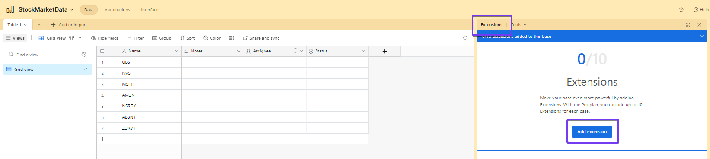
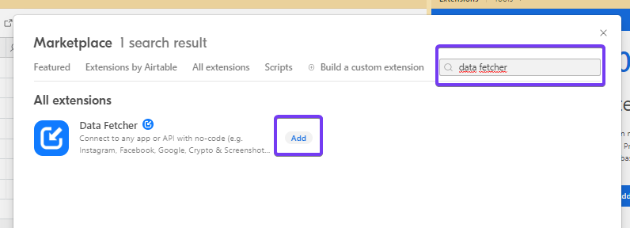
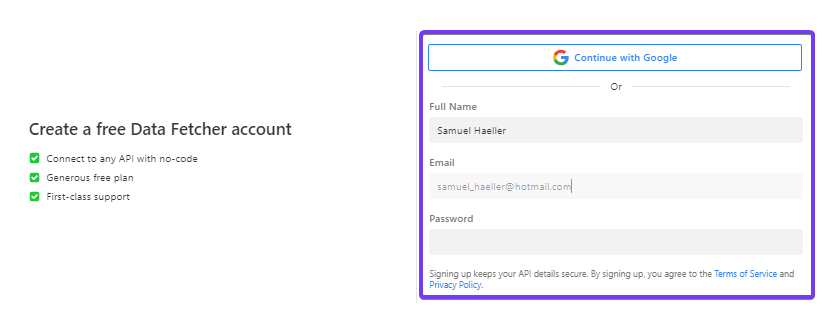
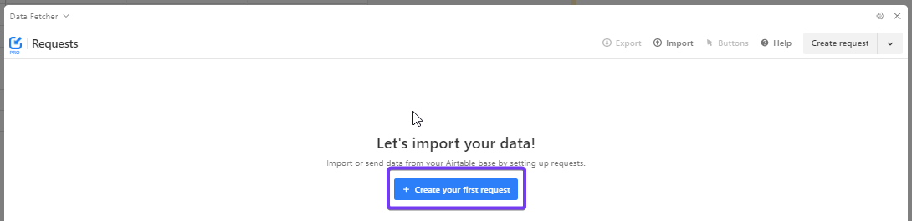
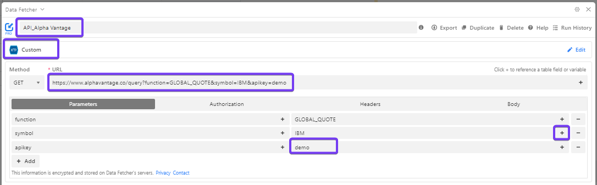

# Setup


### Airtable
Open an account with Airtable - you can do this under the following [link](https://airtable.com/signup). Enter your details - the login process should be self-explanatory. 
<br><br>


<br><br><br><br>

When you are logged in, the app looks like the image below. Now open a new **base**.
<br><br>


<br><br><br><br>

When a new base is opened, Airtable creates an Excel-like interface with a table. In the first column of the table, the symbols of the respective shares of which you want to build a history can be entered. How to determine the symbols of the respective shares is described under [Alpha-Vantage_Stock Selection](../00-Alpha_Vantage/Alpha-Vantage_Stock-Selection.md).
<br><br>


<br><br><br><br>

In order to download the data from Alpha Vantage, the add-on application Data Fetcher is required in Airtable. This tool can be added via **extensions**.
<br><br>


<br><br><br><br>

Search for the tool "Data Fetcher" and add the application.
<br><br>


<br><br><br><br>

Register with the Data Fetcher application. There is a basic version which is free of charge. 
<br><br>


<br><br><br><br>

Start your first request with Data Fetcher.
<br><br>


<br><br><br><br>

1. Name the process
2. Select **Custom**
3. Enter the following Link
   ```
   https://www.alphavantage.co/query?function=SYMBOL_SEARCH&keywords=EMMI&apikey=demo
   ```
4. Replace **demo** with your personal API key. How to get an API Key is explained [here](../00-Alpha_Vantage/Alpha-Vantage_General-Information.md).
5. Click on the + sign next to IBM. 
<br><br>


<br><br><br><br>


<br><br>


