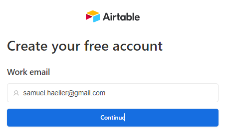
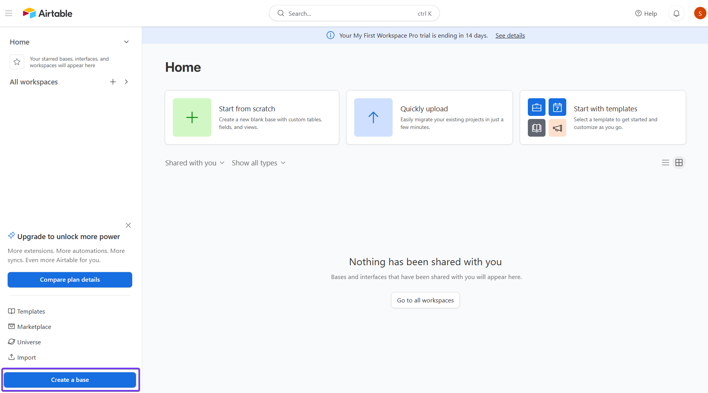
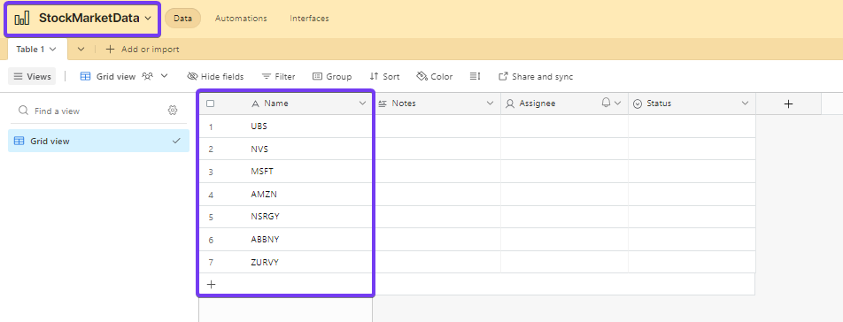

# Setup

### Airtable
Open an account with Airtable - you can do this under the following [link](https://airtable.com/signup). Enter your details - the login process should be self-explanatory. 

When you are logged in, the app looks like the image below. Now open a new **base**.

When a new base is opened, Airtable creates an Excel-like interface with a table. In the first column of the table, the symbols of the respective shares of which you want to build a history can be entered. How to determine the symbols of the respective shares is described under [Alpha-Vantage_Stock Selection](../00-Alpha_Vantage/Alpha-Vantage_Stock-Selection.md).

