# Setup


### Replit
<br><br>
Open an account with Replit - you can do this under the following [link](https://replit.com/login). Enter your details - the login process should be self-explanatory. 
<br><br>


<br><br><br><br>

After you have registered, you will see this screen. To start the project you have to create your first Repl (short for "Read-Eval-Print Loop"). Click on **Create Repl**.
<br><br>
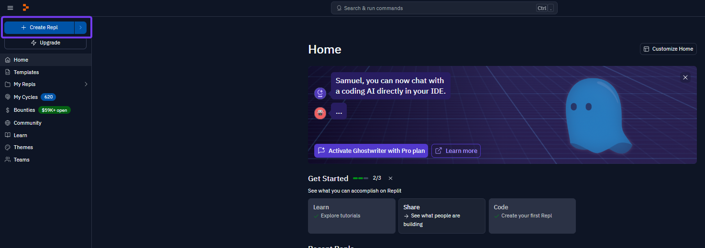

<br><br><br><br>

A new windows opens. 
1. Select Python as a template
2. Name your Repl
3. Decide if you want to have a private or public Repl
   Difference:
   For a public Repl, other users can see your code, but they cannot directly modify it. However, they can create their own copy (Fork) of the Repl and make changes to that copy without affecting your original code.
   With a private Repl, no one except you (or those you explicitly grant access to) can see or modify the code. For a private Repl, you must have a paid user subscription.
4. **Create Repl**
<br><br>
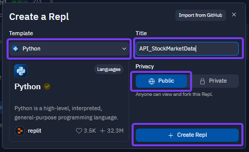

<br><br><br><br>

Once you have created your Repl, the following screen appears in which you manage your Repl.There are for different sections:
 * Files
 * Tools
 * Script (main.py)
 * Console
<br><br>
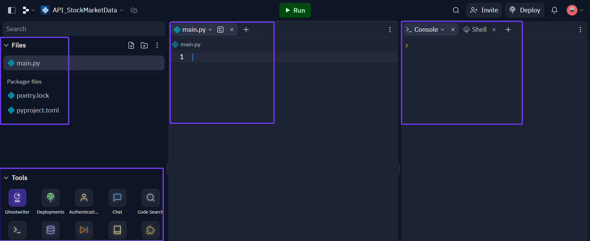

<br><br><br><br>

Before we start writing the Python script, we first create some support files that are necessary for the script to run. On the left side next to **Files** there is a **+** sign. Click on this sign and create a new file with the name ```config.txt```. 
<br><br>
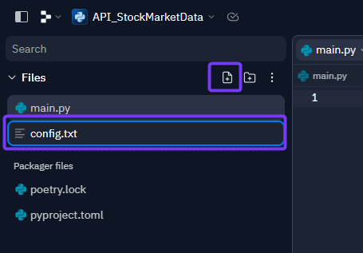

<br><br><br><br>

Open this new file and enter in the code section ```API_KEY=``` as well as your personal API Key from Alpha Vantage. How to request that Key is described [here](../00-Alpha_Vantage/Alpha-Vantage_General-Information.md). In my case, the input looks like this: ```API_KEY=0KNPGB95CEUWLYR7``` 
<br><br>
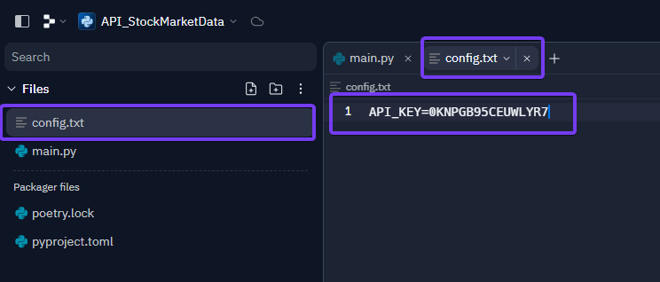

<br><br><br><br>

Create now a second file with the name ```symbols.txt```.  
<br><br>
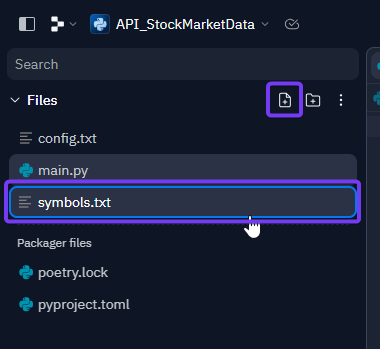

<br><br><br><br>

In this file you can now enter all the symbols of the shares from which you want to download the data. How to determine the symbols of the respective shares is described under [Alpha-Vantage_Stock Selection](../00-Alpha_Vantage/Alpha-Vantage_Stock-Selection.md).
<br><br>
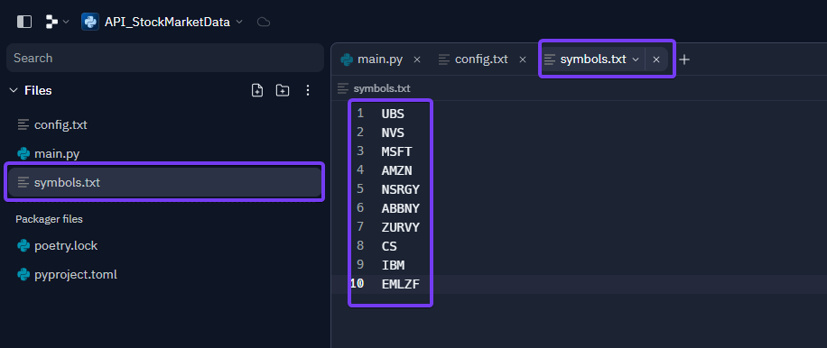

<br><br><br><br>

Create a further file named ```requirements.txt```. Enter in this file ```Flask``` and on a new line ```requests```. Our Python code uses the external **flask** and **request** libraries. By creating these files, we ensure that these programmes are automatically installed.
<br><br>
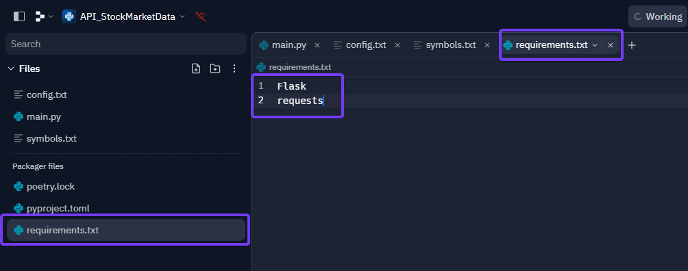

<br><br><br><br>

After we have set up the support files, we can now start with the Python script. The script is structured in different tasks. The first task is to manually download the data from Alpha Vantage. Copy the code below to do this.
<br><br>
```
# Manual download of data - via replit "run"

import requests
import time
from replit import db
from datetime import datetime

def load_symbols_from_file(filename):
    with open(filename, 'r') as file:
        return [line.strip() for line in file]

def load_api_key_from_file(filename):
    with open(filename, 'r') as file:
        for line in file:
            key, value = line.strip().split('=')
            if key == "API_KEY":
                return value
              
symbols = load_symbols_from_file('symbols.txt')
apikey = load_api_key_from_file('config.txt')

for symbol in symbols:
    url = f'https://www.alphavantage.co/query?function=GLOBAL_QUOTE&symbol={symbol}&apikey={apikey}'
    r = requests.get(url)
    data = r.json()
    
    quote = data.get("Global Quote", {})
    trading_day = quote.get("07. latest trading day", "")
    
    # Combine symbol and trading day into a unique key
    unique_key = f"{symbol}_{trading_day}"
    
    # Check if the key is already in the database
    if unique_key not in db:
        # Add the current timestamp if the key is not existing
        quote['timestamp'] = datetime.now().strftime('%Y-%m-%d %H:%M:%S')
        db[unique_key] = quote

    print(data)
    time.sleep(12)
```
<br><br>
This script includes the following items:
1. Import all functions which are required
2. Loads the created supporting files
3. Downloads the data from all the symbols stored in symbols.txt
4. Safes the data in the database
5. Only data is saved which is not in the database yet
6. Since Alpha Vantage has a restriction (only 5 requests per minute) -> there is a time.sleep function which ensures that data is only loaded from one share every 15 seconds. Thus, no more than 4 requests are made per minute. 

<br><br><br><br>

Copy now this script into the **main.py** file in Replit. After that click on the **run** button. This is how you execute the script.
<br><br>
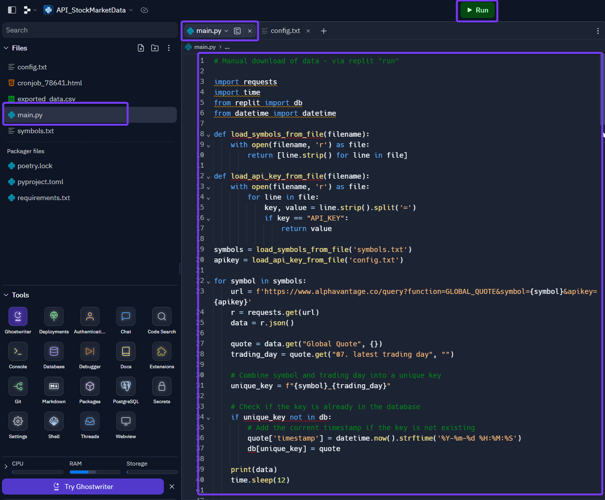

<br><br><br><br>

When you do this for the first time, you see in the console on the right side, that Replit is installing several packages.
<br><br>


<br><br><br><br>

If everything works correctly, you will then see the market data of the stocks you are looking for in the console on the right-hand side.
<br><br>
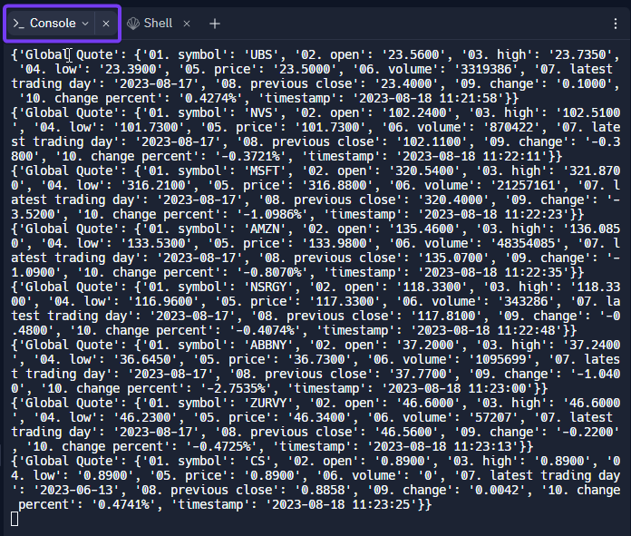

<br><br><br><br>

The manual download of the data is the first part of the code, which we have in our script. However, we will now add other tasks to the script. In order to execute only one task at a time, however, we need to inactivate the rest of the code. This can be done by excluding the code with the characters ```'''```. As soon as the characters appear orange, these lines are no longer executed. Exclude this code. 
<br><br>
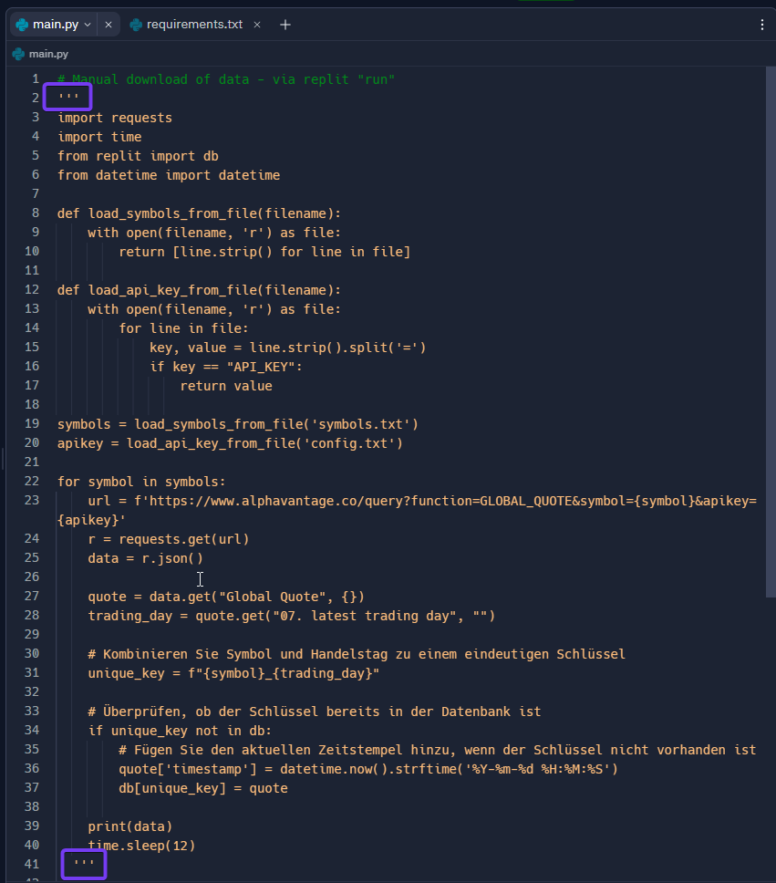
If there is a **#** at the beginning of a line, then it is a comment. A comment is never executed and serves only as information. 

<br><br><br><br>

We will now add some more code to the script. The following code retrieves the content from the database and we can access our stored data. Copy this code. 
<br><br>
```
# Display database

from replit import db

# Print header
print("Symbol,Open,High,Low,Price,Volume,Latest Trading Day,Previous Close,Change,Change Percent,Timestamp")  # Hinzufügen von "Timestamp" zur Kopfzeile

# Extract all data from the database into a list
data_list = []

for key in db.keys():
    quote = db[key]

    # Check if all required keys are present
    if all(k in quote for k in ['01. symbol', '02. open', '03. high', '04. low', '05. price', '06. volume', '07. latest trading day', '08. previous close', '09. change', '10. change percent']):
        data_list.append(quote)
    else:
        # Print error message if not all keys are present
        print(f"Fehlende Schlüssel in Eintrag für {key}")

# Sort data list by the "Symbol"
sorted_data = sorted(data_list, key=lambda x: x['01. symbol'])

# Print sorted data
for quote in sorted_data:
    print(f"{quote['01. symbol']},{quote['02. open']},{quote['03. high']},{quote['04. low']},{quote['05. price']},{quote['06. volume']},{quote['07. latest trading day']},{quote['08. previous close']},{quote['09. change']},{quote['10. change percent']},{quote.get('timestamp', '')}")  
```

<br><br><br><br>

Add the code to the script. You can simply add the code below the existing code in the skript (**main.py**). Once you have copied the code, run the script. **Run**. 
<br><br>
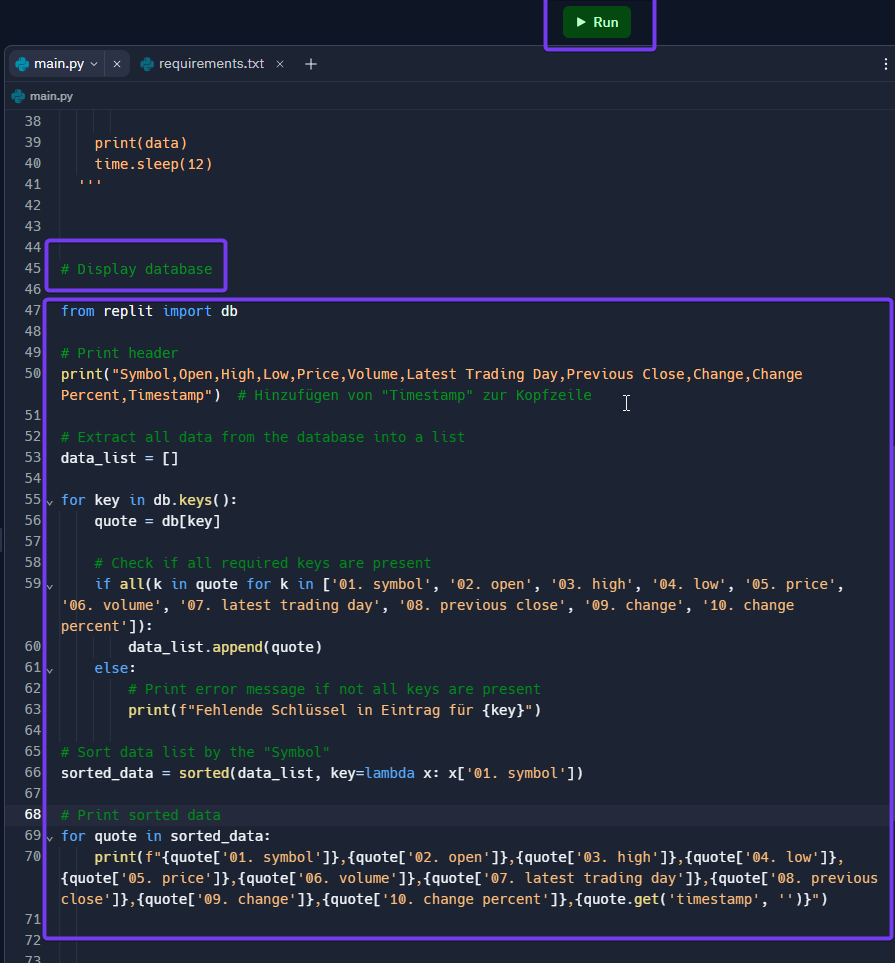

<br><br><br><br>

On the right-hand side, the result is displayed in the console after the script has been executed.
<br><br>
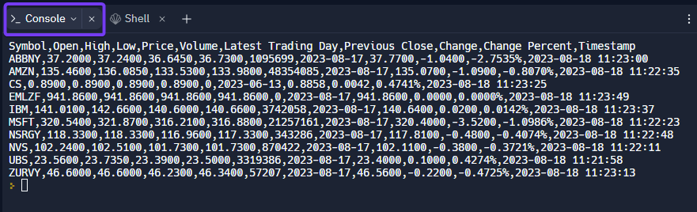

<br><br><br><br>

Again, make the code inactive by placing the characters ```'''``` around the code. We do this to be able to complete the code further.
<br><br>
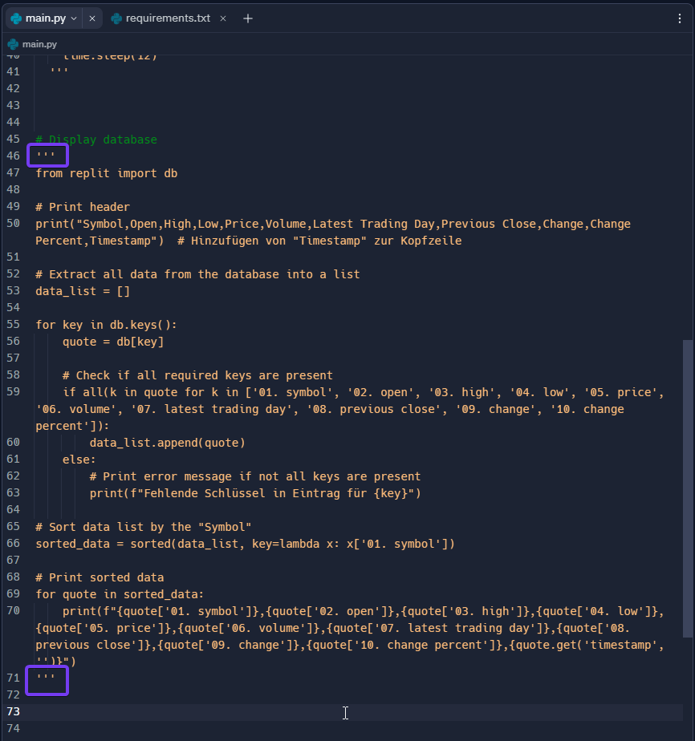

<br><br><br><br>

The next code is for loading the data from the database into a csv file. This can then simply be downloaded. Copy the following code.
<br><br>
```
# Export database to csv

import csv
from replit import db

# Filename for the CSV file
filename = "exported_data.csv"

# Open CSV file for writing
with open(filename, 'w', newline='') as csvfile:
    # Create CSV writer object
    csvwriter = csv.writer(csvfile)
    
    # Write CSV header
    headers = ["Symbol", "Open", "High", "Low", "Price", "Volume", "Latest Trading Day", "Previous Close", "Change", "Change Percent", "Timestamp"]
    csvwriter.writerow(headers)
    
    # Iterate through all keys in the database
    for key in db.keys():
        quote = db[key]
        row = [
            quote.get("01. symbol", ""),
            quote.get("02. open", ""),
            quote.get("03. high", ""),
            quote.get("04. low", ""),
            quote.get("05. price", ""),
            quote.get("06. volume", ""),
            quote.get("07. latest trading day", ""),
            quote.get("08. previous close", ""),
            quote.get("09. change", ""),
            quote.get("10. change percent", ""),
            quote.get("timestamp", "")  # Adding the timestamp
        ]
        
        # Write row to CSV
        csvwriter.writerow(row)
```

Now add this code under the existing code in the script. **Run** the script.
<br><br>
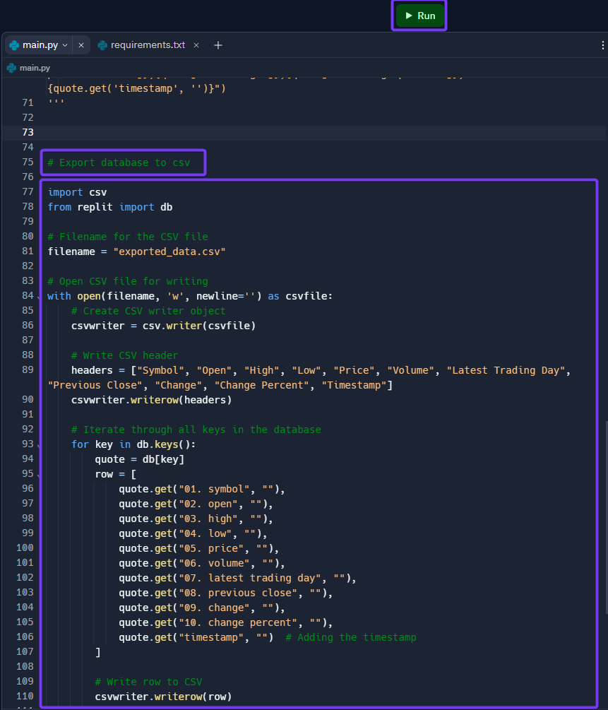

<br><br><br><br>

On the left side under **Files** the file **exported_data.csv** has now been created. If you click on it, you will see the data contained in this csv. You can now download this csv for your further use.
<br><br>
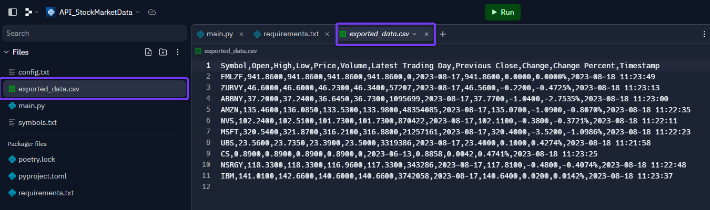

<br><br><br><br>

Now set this code to inactive as well by using the ```'''``` characters.
<br><br>
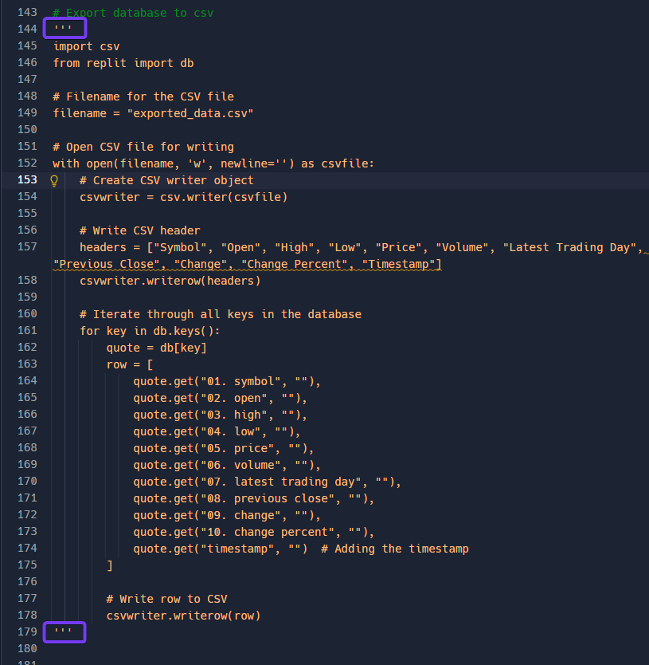

<br><br><br><br>

The next code we need is if we want to delete the contents of the database. Again, copy the code below.
<br><br>
```
# Delete data in database

from replit import db

# Iterate through all keys in the database and delete each key
for key in db.keys():
    del db[key]

# Delete csv file manually
```

<br><br><br><br>

1. Click on **Database** under **Tools** at the bottom left.
2. A tab **Database** opens on the right-hand side next to Console - there you will see that there are **keys** in the database. This is the number of data records contained in the database.
3. Now copy the code into the script and execute it. **Run**.
<br><br>
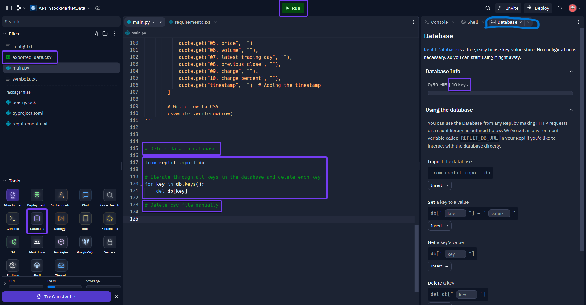

<br><br><br><br>

When you have executed the script, the data in the database should be deleted after a few seconds. Check this under **Database**.
<br><br>
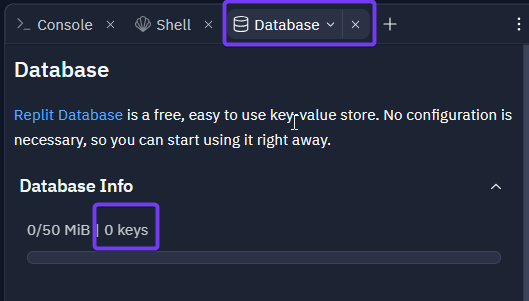
<br><br>
This way you can delete the contents of the database. You have to delete the csv file manually. Left-click on the file and delete.

<br><br><br><br>

Again, set this code to inactive by using the ```'''``` characters.
<br><br>


<br><br><br><br><br>

We now have the codes for the following tasks in our script:
<br>
 * Manual download of the data
 * Viewing the database
 * Creation of a csv file
 * Deleting the database
<br>
What is missing now is the code to run the script automatically on a daily basis. Once again, make sure that all codes are set to inactive and then we'll get started. 

<br><br><br><br><br>

The following code now forms the core of our script. This code can no longer be executed manually, but is triggered via the web. More about this later. Copy the code.
<br><br>
```
# Start via CRONJOB.DE (automatic execution)
# manual start via Web; https://apistockmarketdata.samuelhaller.repl.co/fetchdata

import requests
import time
from replit import db
from flask import Flask
from datetime import datetime  # Importing the datetime module

app = Flask(__name__)

def load_symbols_from_file(filename):
    with open(filename, 'r') as file:
        return [line.strip() for line in file]

def load_api_key_from_file(filename):
    with open(filename, 'r') as file:
        for line in file:
            key, value = line.strip().split('=')
            if key == "API_KEY":
                return value
    return None

symbols = load_symbols_from_file('symbols.txt')
apikey = load_api_key_from_file('config.txt')

def fetch_data():
    for symbol in symbols:
        url = f'https://www.alphavantage.co/query?function=GLOBAL_QUOTE&symbol={symbol}&apikey={apikey}'
        r = requests.get(url)
        data = r.json()
        
        quote = data.get("Global Quote", {})
        trading_day = quote.get("07. latest trading day", "")
        
        # Combine symbol and trading day into a unique key
        unique_key = f"{symbol}_{trading_day}"
        
        # Add the current timestamp
        quote['timestamp'] = datetime.now().strftime('%Y-%m-%d %H:%M:%S')
        
        # Check if the key is already in the database
        if unique_key not in db:
            db[unique_key] = quote

        print(data)
        time.sleep(15)

@app.route('/')
def home():
    return "Welcome to my Flask app!"

@app.route('/fetchdata')
def fetch_data_route():
    fetch_data()
    return "Data fetching completed!"

@app.route('/cronjob_78641.html')
def cron_verification():
    return "cronjob.de"

if __name__ == "__main__":
    app.run(host="0.0.0.0", port=8080)
```
<br><br>
This script includes the following items:
1. Import all functions which are required - including Flask. Due to this package the code is executed via web.
2. Loads the created supporting files.
3. Downloads the data from all the symbols stored in symbols.txt.
4. Safes the data in the database.
5. Only data is saved which is not in the database yet.
6. Depending on the web entries, different returns are triggered - more about that later.
7. A timestamp is added with the time when the data was added to the database.
8. Since Alpha Vantage has a restriction (only 5 requests per minute) -> there is a time.sleep function which ensures that data is only loaded from one share every 15 seconds. Thus, no more than 4 requests are made per minute. 

<br><br><br><br>

Now copy the code into the script. As this code is the most important, copy the code at the beginning - 1st line.
<br><br>


<br><br><br><br>

In order for this code to be called via external web, the script must always be running. In other words, the cloud server must be online so that the script can download the data from Alpha Vantage at all time. To ensure that the script is always running and does not automatically go offline after some time, we must activate **Always On**. To do this, click on the blue Python symbol at the top right. In order to activate this, you must either buy "My Cicles" or make a paid subscription. It is recommended to take the **Hacker** subscription. With this version you also get more storage space in your database. You can find the prices [here](https://replit.com/pricing).
<br>
If you have bought the "My Cicles" or made the Subscription, activate the **Always On**.
<br><br>
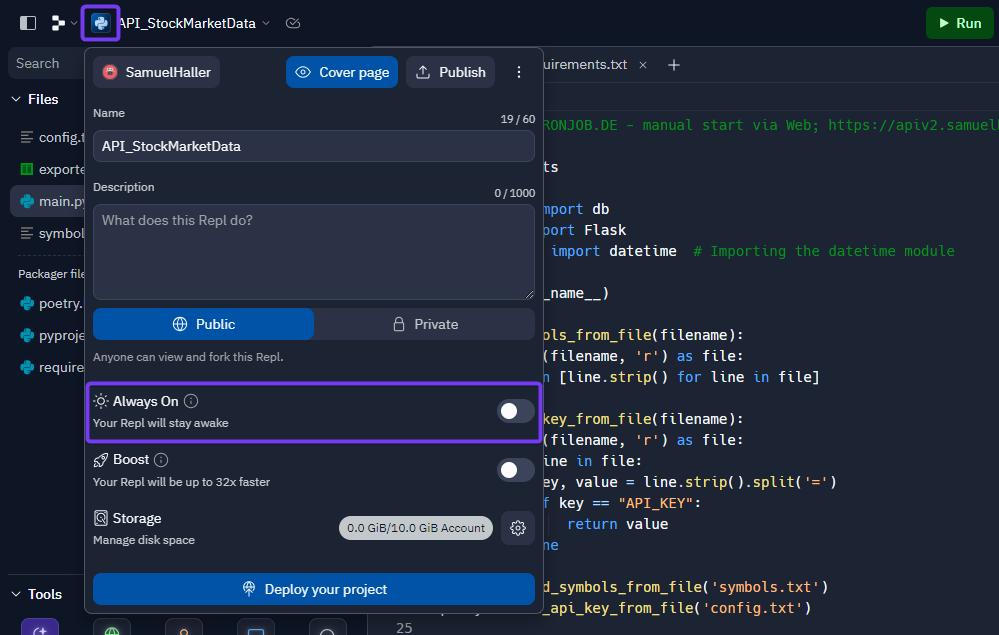

<br><br><br><br>

Now click on **Run**. A webview will now open on the right-hand side. You will now see a link with your project und user name. Copy this link and write it into your code in the script (line 2 in the image below).  Add ```Https://``` to the front of the code and add ```/Fetchdata``` to the back. **This is the code with which you execute the script.**  
<br><br>
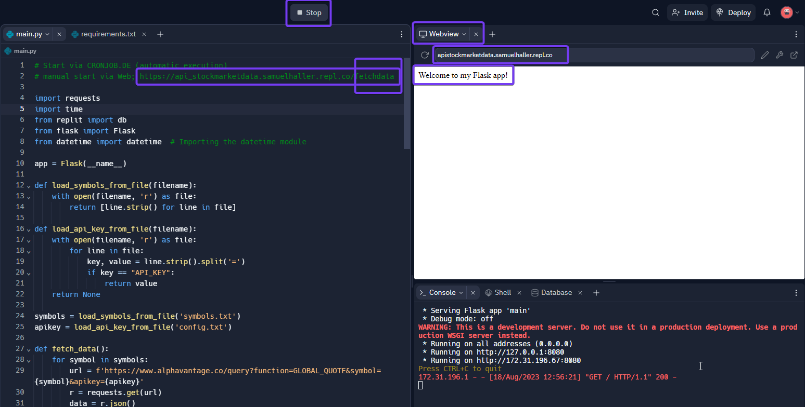
<br><br><br><br>

In summary, the following can be said:

* Code: **Https://apistockmarketdata.samuelhaller.repl.co**    (acc. Replit webview)
  Checks if the script runs.
  *Can be triggered when script is executed in Replit (**Run**) or the link is entered on the web.*
  Gives as response "Welcome to my Flask app!"
  
* Code: **Https://apistockmarketdata.samuelhaller.repl.co/fetchdata**
  Is executing script and downloads data.
  *Can only be executed if the link is executed via the web.*
  Gives as response "Data fetching completed!"

<br><br>
Example of what it looks like when triggered via the web.
<br><br>
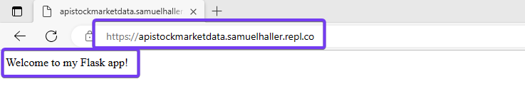
<br><br>
Please note, this is only working when the script in Replit is **running**.


Mit welchem Link wird was gemacht....


Auflistung, welche Codes im Skript enthalten sind.
Reminder - damits lauft. immer auf *RUN* und erster Teil aktiv - rest ausgeklammert


