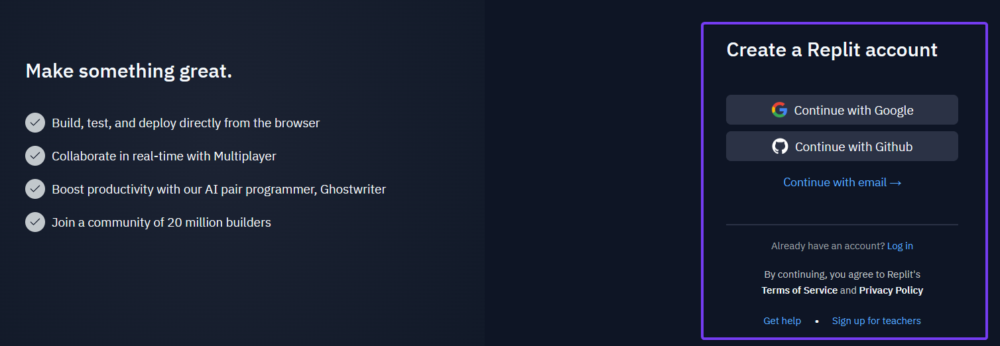
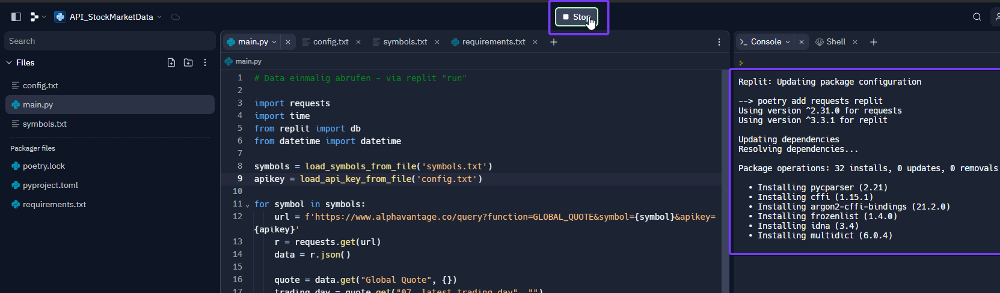

# Setup


### Replit
<br><br>
Open an account with Replit - you can do this under the following [link](https://replit.com/login). Enter your details - the login process should be self-explanatory. 
<br><br>


<br><br><br><br>

After you have registered, you will see this screen. To start the project you have to create your first Repl (short for "Read-Eval-Print Loop"). Click on **Create Repl**.
<br><br>


<br><br><br><br>

A new windows opens. 
1. Select Python as a template
2. Name your Repl
3. Decide if you want to have a private or public Repl
   Difference:
   For a public Repl, other users can see your code, but they cannot directly modify it. However, they can create their own copy (Fork) of the Repl and make changes to that copy without affecting your original code.
   With a private Repl, no one except you (or those you explicitly grant access to) can see or modify the code. For a private Repl, you must have a paid user subscription.
4. **Create Repl**
<br><br>


<br><br><br><br>

Once you have created your Repl, the following screen appears in which you manage your Repl.There are for different sections:
 * Files
 * Tools
 * Script (main.py)
 * Console
<br><br>


<br><br><br><br>

Before we start writing the Python script, we first create some support files that are necessary for the script to run. On the left side next to **Files** there is a **+** sign. Click on this sign and create a new file with the name **config.txt**. 
<br><br>


<br><br><br><br>

Open this new file and enter in the code section ```API_KEY=``` as well as your personal API Key from Alpha Vantage. How to request that Key is described [here](../00-Alpha_Vantage/Alpha-Vantage_General-Information.md). In my case, the input looks like this: ```API_KEY=0KNPGB95CEUWLYR7``` 
<br><br>


<br><br><br><br>

Create now a second file with the name **symbols.txt**.  
<br><br>


<br><br><br><br>

In this file you can now enter all the symbols of the shares from which you want to download the data. How to determine the symbols of the respective shares is described under [Alpha-Vantage_Stock Selection](../00-Alpha_Vantage/Alpha-Vantage_Stock-Selection.md).
<br><br>


<br><br><br><br>

Create a further file named **requirements.txt**. Enter in this file **Flask** and on a new line **requests**. Our Python code uses the external **flask** and **request** libraries. By creating these files, we ensure that these programmes are automatically installed.
<br><br>


<br><br><br><br>

After we have set up the support files, we can now start with the Python script. The script is structured in different tasks. The first task is to manually download the data from Alpha Vantage. Copy the code below to do this.
<br><br>
```
# Manual download of data - via replit "run"

import requests
import time
from replit import db
from datetime import datetime

def load_symbols_from_file(filename):
    with open(filename, 'r') as file:
        return [line.strip() for line in file]

def load_api_key_from_file(filename):
    with open(filename, 'r') as file:
        for line in file:
            key, value = line.strip().split('=')
            if key == "API_KEY":
                return value
              
symbols = load_symbols_from_file('symbols.txt')
apikey = load_api_key_from_file('config.txt')

for symbol in symbols:
    url = f'https://www.alphavantage.co/query?function=GLOBAL_QUOTE&symbol={symbol}&apikey={apikey}'
    r = requests.get(url)
    data = r.json()
    
    quote = data.get("Global Quote", {})
    trading_day = quote.get("07. latest trading day", "")
    
    # Combine symbol and trading day into a unique key
    unique_key = f"{symbol}_{trading_day}"
    
    # Check if the key is already in the database
    if unique_key not in db:
        # Add the current timestamp if the key is not existing
        quote['timestamp'] = datetime.now().strftime('%Y-%m-%d %H:%M:%S')
        db[unique_key] = quote

    print(data)
    time.sleep(12)
```
<br><br>
This script includes the following items:
1. Import all functions which are required
2. Loads the created supporting files
3. Downloads the data from all the symbols stored in symbols.txt
4. Safes the data in the database
5. Only data is saved which is not in the database yet
6. Since Alpha Vantage has a restriction (only 5 requests per minute) -> there is a time.sleep function which ensures that data is only loaded from one share every 15 seconds. Thus, no more than 4 requests are made per minute. 

<br><br><br><br>

Copy now this script into the **main.py** file in Replit. After that click on the **run** button. This is how you execute the script.
<br><br>


<br><br><br><br>

When you do this for the first time, you see in the console on the right side, that Replit is installing several packages.
<br><br>


<br><br><br><br>

If everything works correctly, you will then see the market data of the stocks you are looking for in the console on the right-hand side.
<br><br>


<br><br><br><br>
