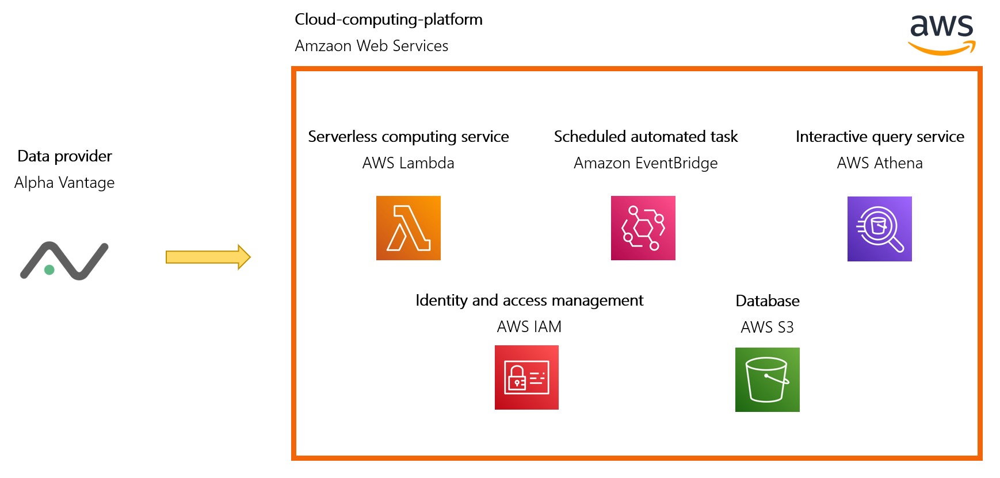
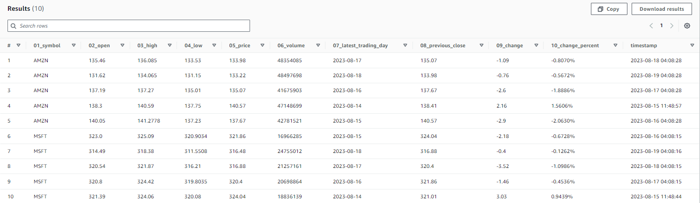
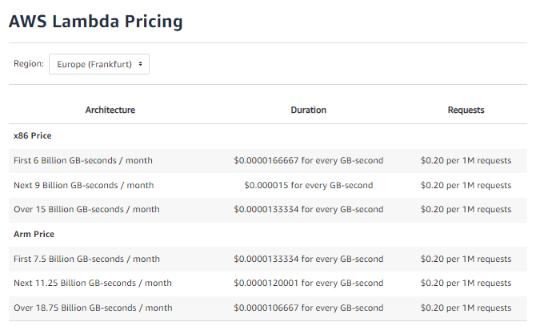
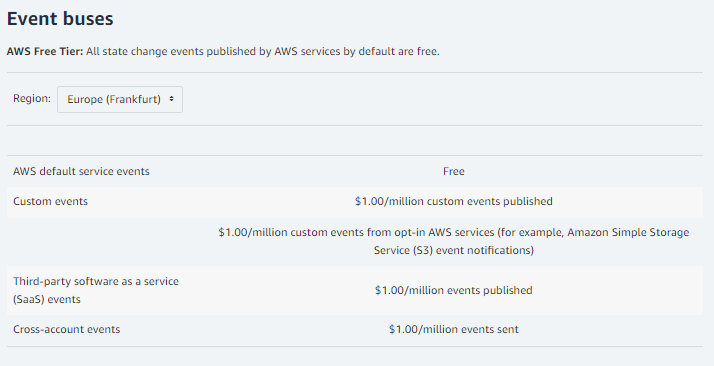
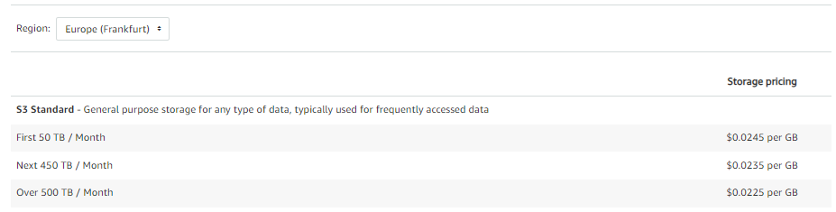
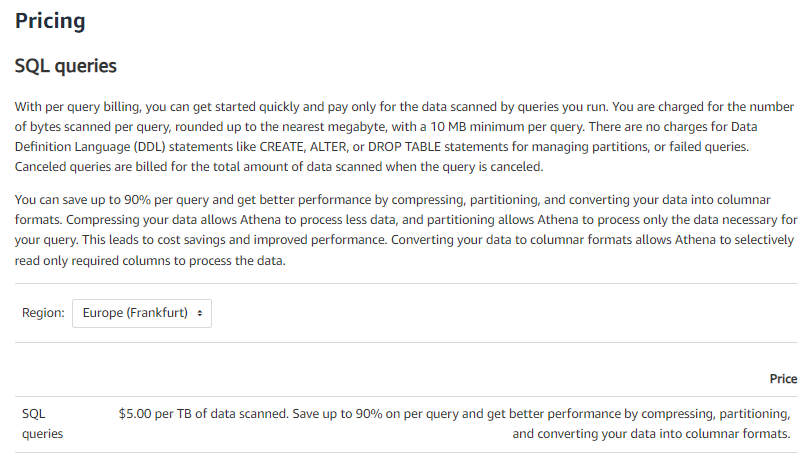
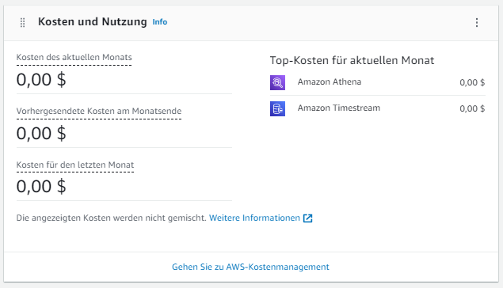

# General information about Amazon Web Service
  
AWS, or [Amazon Web Services](https://aws.amazon.com/de/), is a subsidiary of Amazon providing on-demand cloud computing platforms and APIs to individuals, companies, and governments. It offers a broad set of tools and services including computing power, storage, and databases. AWS enables its users to run applications, host websites, and manage big data on a scalable and reliable infrastructure. For our project, we only need services from AWS in addition to the external data provider [Alpha Vantage](https://www.alphavantage.co/#page-top).

The following figure shows which applications are used for the daily download of data via API in AWS.

1. As with the other approches, the data is provided by the market data provider [Alpha Vantage](../00-Alpha_Vantage).
2. AWS is a common cloud-computing-platfomr which offers a whole range of different tools. For our aim we are using the following AWS applications:
    * **AWS Lambda**: Serverless computing service that automatically runs code in response to specific events without requiring the management of servers. Our python script will run with Lambda. 
    * **AWS IAM**: Service that allows users to control access to AWS resources in a secure manner.
    * **Amazon EventBridge**: Serverless event bus service that facilitates the connection of applications using data from various sources. Responsible in this project for running the code in Lambda on a daily basis. 
    * **AWS S3**: Scalable cloud storage service that allows users to store and retrieve data.
    * **AWS Athena**: Serverless interactive query service that enables analysis of data in Amazon S3 using SQL.
 

  
    

## Result
 
The end result is a database with daily records on the requested shares. 
  

  
This data can be downloaded in a csv file.

    

## Running costs
 
Pricing with AWS is more complex than with the other two methods. AWS pricing varies significantly across its vast range of services and is influenced by factors such as data volume, request frequency, and regional costs.
 

**Generally, users pay for what they use, with many services operating on a pay-as-you-go model.** 
   
Here is a list of the costs of each service:
  
### AWS Lambda
 
 
Here the detailed costs of AWS Lambda: [Pricing](https://aws.amazon.com/lambda/pricing/)

  

### Amazon EventBridge
 
 
Here the detailed costs of Amazon EventBridge: [Pricing](https://aws.amazon.com/eventbridge/pricing/)

  

### AWS S3
 
 
Here the detailed costs of AWS S3: [Pricing](https://aws.amazon.com/s3/pricing/)

  

### AWS Athena
 
 
Here the detailed costs of AWS Athena: [Pricing](https://aws.amazon.com/athena/pricing/)

  

### Personal cost overview
 
Even with this information above, it is very difficult to get an estimate of how the costs will behave for our project. Therefore, here is an overview of my costs:
  
Duration: 1 month
Number of shares: 10 pieces 
 

