# Setup


### Amazon Web Service AWS
<br><br>
Open an account with AWS - you can do this under the following [link](https://aws.amazon.com/). Enter your details - the login process should be self-explanatory. Since AWS is chargeable, you will also be asked for your payment method. The easiest way is to store your credit card.
<br><br>
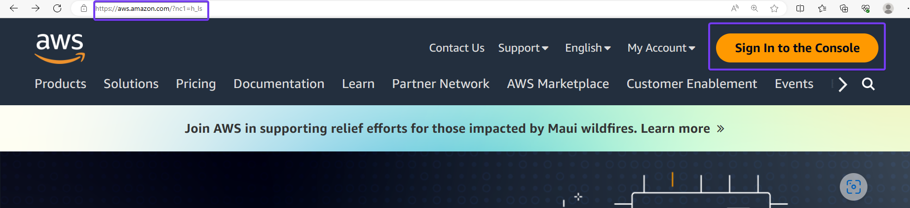

<br><br><br><br>

After you have registered, you will be taken to the AWS Home console. This gives you an overview of the most important points. For us, the following points are particularly relevant:
 * **Recently visited**: All tools we require for this project are marked.
 * **Cost and usage**: Gives you an overview of the running costs of your applications.
<br>
We now start with setting up the database. Please enter **S3** in the search field above. 
<br><br>
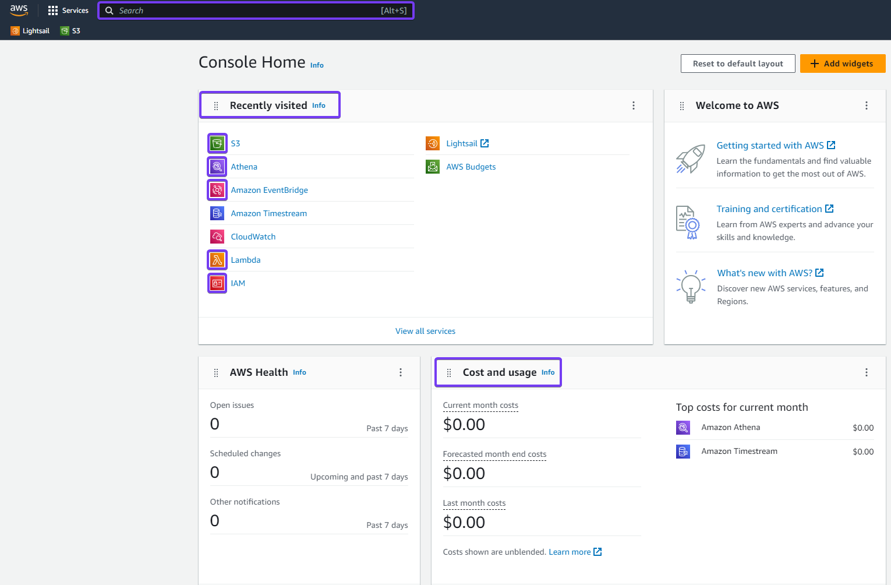

<br><br><br><br>

### S3
<br><br>
We now open an S3 bucket to store the data loaded by Alpha Vantage. **Create bucket**.
<br><br>
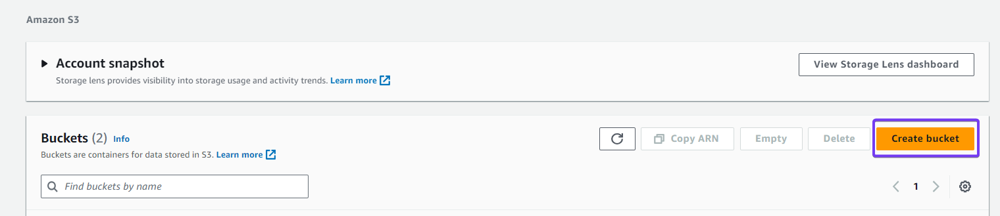

<br><br><br><br>

Give your bucket a name - in this example I call the bucket ```api.alphavantage.data```. Please consider the rules für bucket naming (min. 3 characters, only lowercase letters, must begin or end with letter or number). 
<br>
Select the AWS Region. This allows you to select the location where your data is to be stored. Select your nearest location - the nearest location from Switzerland is Frankfurt.
<br><br>
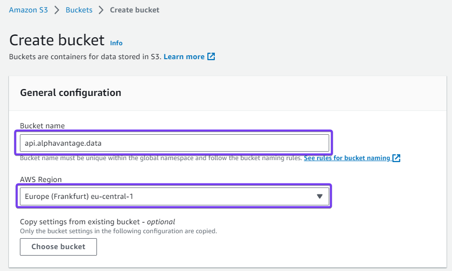

<br><br><br><br>

Leave the default selections:
 * **ACLs disabled**
 * **Block all public access**
<br><br>
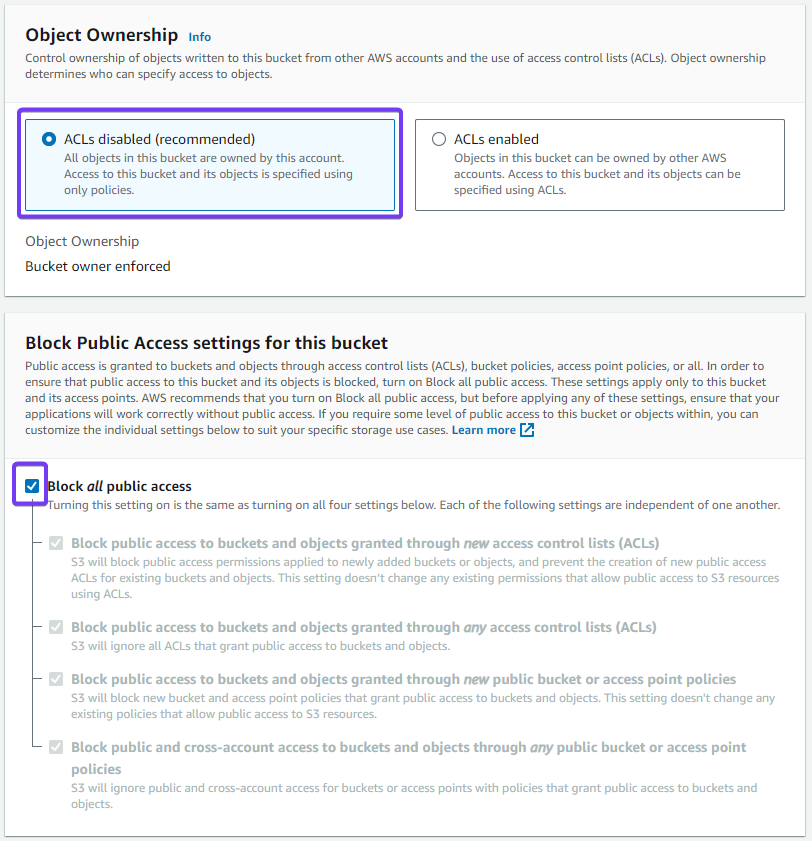

<br><br><br><br>

For the further selection, leave the standard selection as well. **Create bucket**
<br><br>
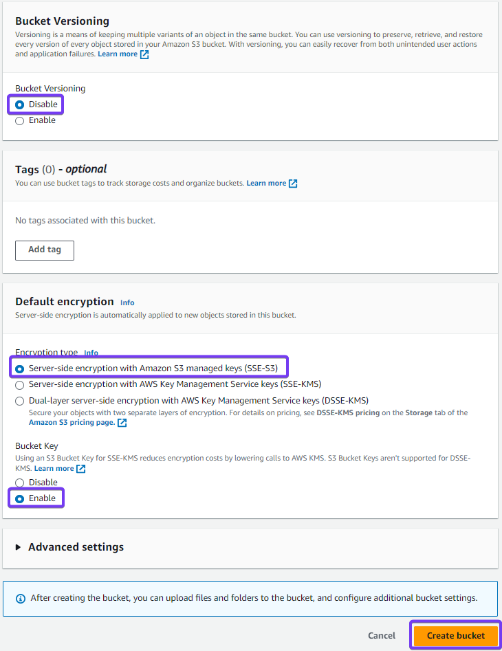

<br><br><br><br>

After the bucket has been successfully created, we now create a second one. The second bucket is needed so that Athena (database) can write down the data on a folder. 
<br>
Open another bucket - **Create bucket**. This time give the name ```api.athena.data```. Otherwise, make the same selections as for the previous bucket.
<br><br>
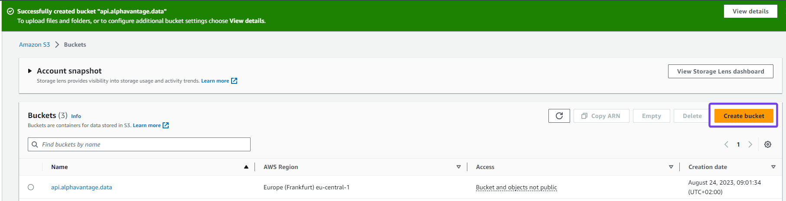

<br><br><br><br>

If you have also opened the second bucket, your Amazon S3 menu should look like the image below.
<br>
We now start with setting up the script for loading the data form Alpha Vantage. Please enter **Lambda** in the search field. 
<br><br>
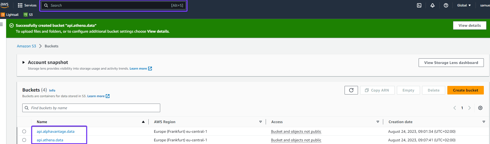

<br><br><br><br>

### AWS Lambda
<br><br>
Create now a new function. **Create function**.
<br><br>
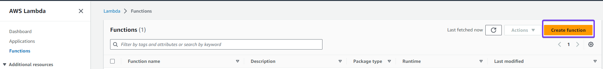

<br><br><br><br>

To create a function do the following:
1. Select *Author from scratch*
2. Give your function a name - in this example ```api_alphavantage```
3. Select the most current Python version - in this case it is *Python3.11*
4. Select the architecture *x86_64*
5. **Create function**
<br><br>
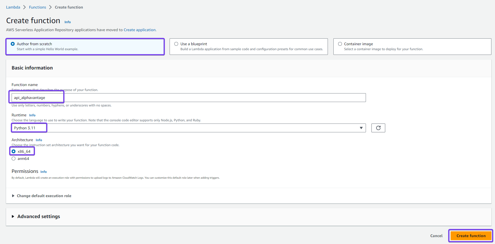

<br><br><br><br>

Before we enter our script we test the application. Click on **Test**.
<br><br>
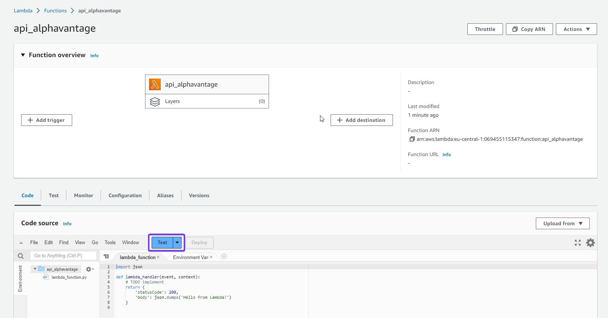

<br><br><br><br>

Configure the test event. Name the event. Beside that, nothing has to be adjusted. **Save**.
<br><br>
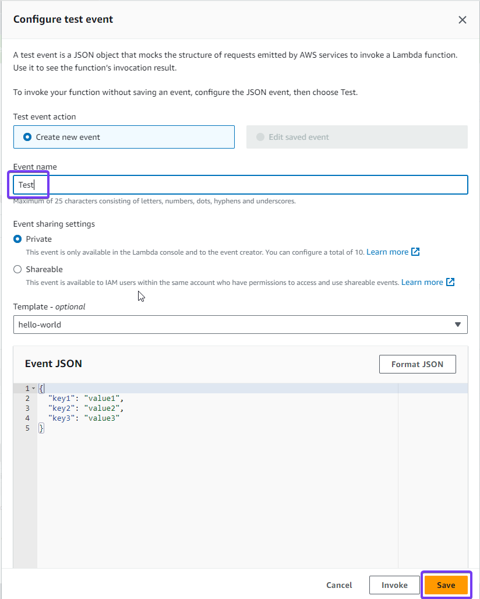

<br><br><br><br>

Now click on **Test** again. A new tab opens in the *Code source* menu. If you get the the same message as in the image below, everything is set up correctly so far. 
<br><br>


<br><br><br><br>

Before we continue with setting up our Lambda function, we need to make sure that Lambda has access to our S3 bucket. The easiest way to do this is to duplicate the existing web window tab so that you can directly edit your Lambda function afterwards.
<br>
1. Dublicate window tab
2. Enter **IAM** in the search field
3. Go now to **Policies**
4. Create a new policy. **Create policy**
<br><br>
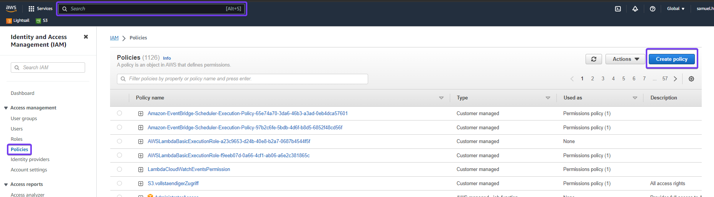

<br><br><br><br>

Now proceed as follows to set up the permission.
1. Click on **JSON**
2. Enter the following code:
   ```
   {
    "Version": "2012-10-17",
    "Statement": [
        {
            "Effect": "Allow",
            "Action": "s3:*",
            "Resource": "*"
        }
    ]
   }
   ```
   This gives your Lambda function full permission for all S3 related actions in all buckets of your account, which is not optimal for security reasons. It is generally a best practice to follow the principle of least privilege (only as much as necessary). However, for this test case we use this code as it is simpler. 
3. **Next** 
<br><br>
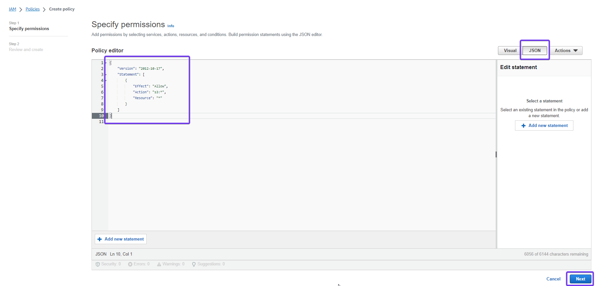

<br><br><br><br>

Now give the policy a name (e.g. ```Full_Access_S3_Lambda```) and write down a description (e.g. ```Full access for Lamdba in S3```). After that **Create policy**.
<br><br>
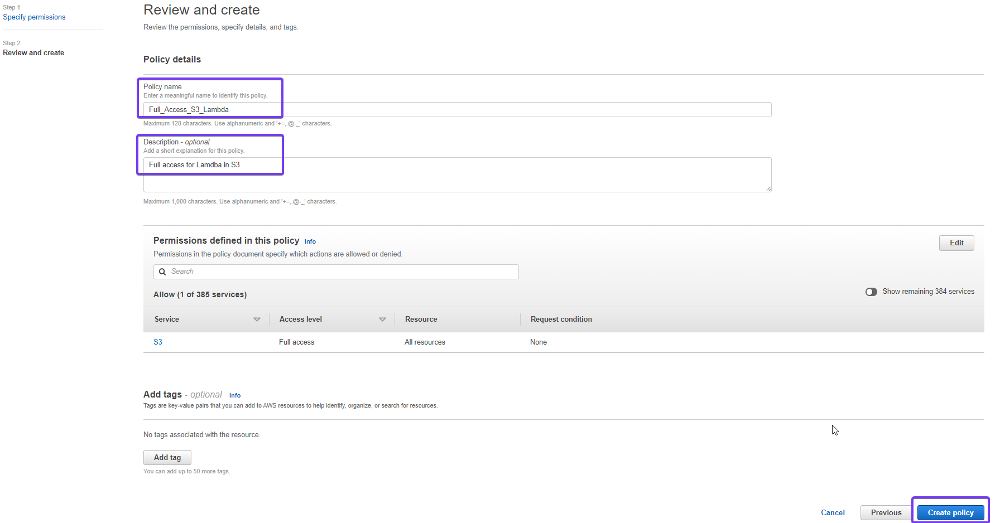

<br><br><br><br>

Go back to the IAM menu and click on the left side on **Roles**. Select your Lambda Function - the role starts with the name of your function. In this case its is *api_alphavantage-role-aju6yhkx*.
<br><br>
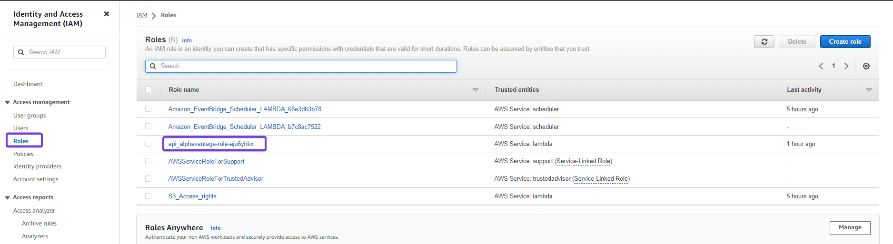

<br><br><br><br>

Under *Permissions* you can now click on **Add permissions**. 
1. Choose **Attach policies**
2. Select your created policy (e.g. *Full_Access_S3_Lambda*)
3. **Add permissions**
<br>
Once you have added the respective policy, it should appear in your list. 
<br><br>
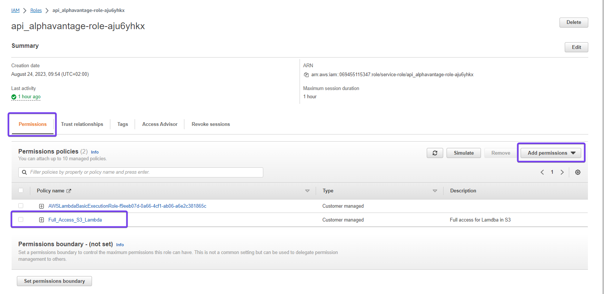

<br><br><br><br>

We use Python to download the data. In Python we use the *requests* library (an already prefabricated Python package). In AWS Lambda, not all Python libraries are available by default. Therefore, you need to provide them together with your Lambda code. For this we need to do the following steps:
1. Open your local *Command Prompt*. To do this, click **Win + R** on your keyboard. Windows open - enter **cmd**. **OK**.
2. Use the command **cd** followed by the path to navigate to the directory where you want to create a new directory. For example: **cd C:\Users\YourName\Documents**. In the image below, I have entered the path as it would look on my PC. When you have entered this. Press **Enter**.
3. A new line now appears and you can see that the working directory has now been changed according to my entry under step #2. 
<br><br>
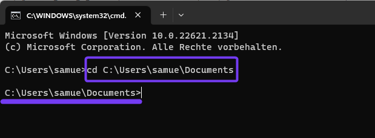


<br><br><br><br>

Now copy the following code into your *cmd*: ```mkdir my_lambda_package```. Press **Enter**.
<br><br>


<br><br><br><br><br>

We have now opened the folder. Now we will download the *requests* library.
1. Change the working directory. You can do this by entering the following code into the console ```cd my_lambda_package```. Press enter.
2. Install the request library. Type ```pip install requests -t .``` and execute it by pressing enter.
<br><br>
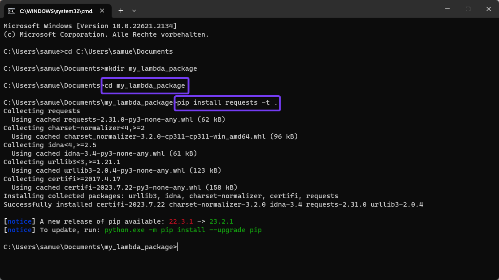

<br><br><br><br>

Now check in your folder **my_lambda_package** whether the download worked.
<br>
If you see these folders, it worked.
<br><br>
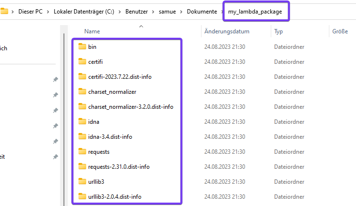

<br><br><br><br>

Now open your tab with the AWS Lambda function.
1. Click on **Actions**
2. Select **Export function**
3. Choose **Download deployment package**  
<br><br>
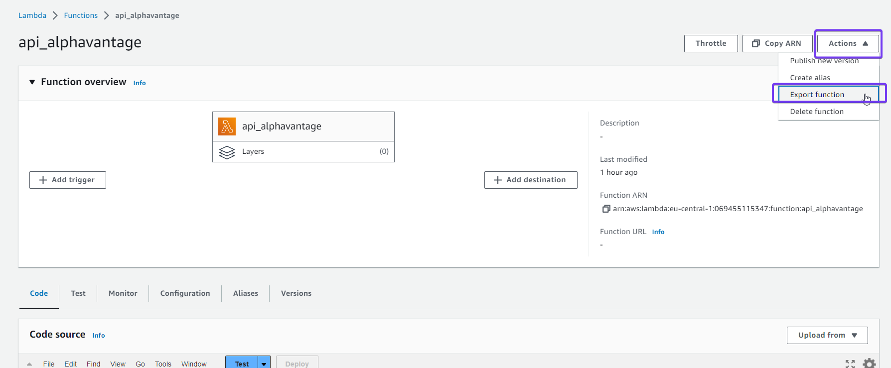
<br><br><br><br>

Now open the folder where the file was downloaded - probably in the *Downloads* folder - and copy the lambda_function.py file (*Ctrl + C*) and save it in your my_lambda_package folder (*Ctrl +V*).
<br><br>
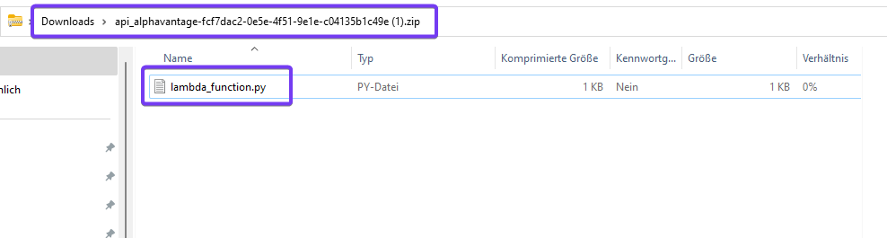

<br><br><br><br>

We now need to create a zip file.
1. Go to your *my_lambda_package* folder.
2. Mark all folders (*Ctrl + A*)
3. Left click and select **Compress to ZIP file**.
4. Give the zip file the name **my_Lambda_package.zip**.  
<br><br>
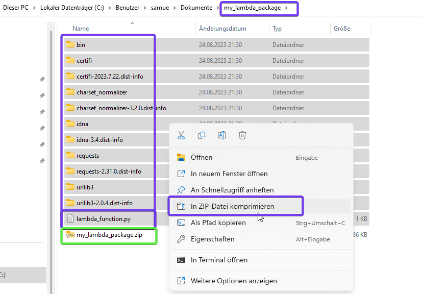
<br>
The folder marked in green is the new zip file created.
<br><br><br><br>

Now go back to the Lambda function in AWS. 
1. Go to **Upload from**
2. Select **.zip file**
3. Click on **Upload**
4. Select your zip file (*my_lambda_package.zip)
5. **Save**
<br><br>
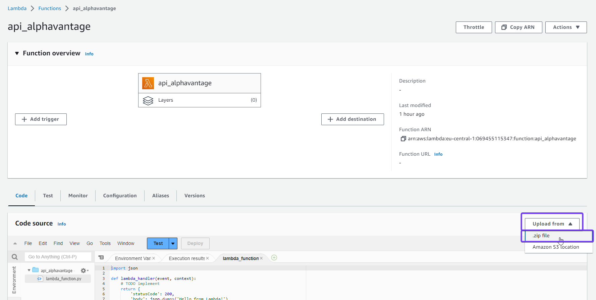

<br><br><br><br>

Your *Code source* should now contain the same files as shown in the image below.
<br><br>
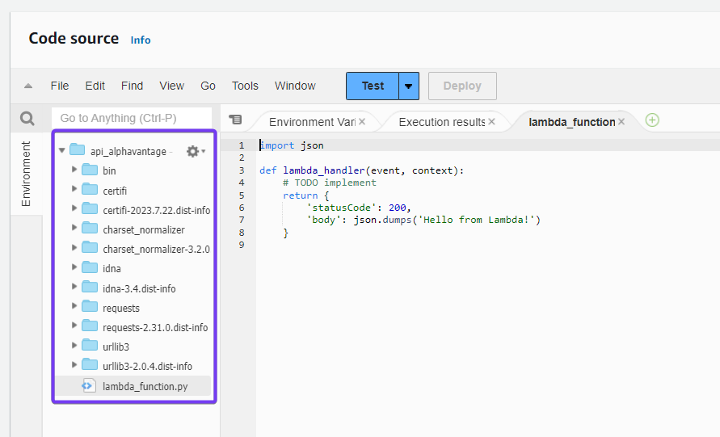

<br><br><br><br>

Now we can place our Python code into the Lambda_function.py file. Copy the following code.
```
import requests
import time
import json
import boto3
import os
from datetime import datetime

# Initialisieren des S3-Clients
s3 = boto3.client('s3')
BUCKET_NAME = 'data.alphavantage'

# Lese Umgebungsvariablen
apikey = os.environ['API_KEY']
symbols = os.environ['SYMBOLS'].split(',')

def lambda_handler(event, context):
    for symbol in symbols:
        url = f'https://www.alphavantage.co/query?function=GLOBAL_QUOTE&symbol={symbol}&apikey={apikey}'
        r = requests.get(url)
        data = r.json()
        
        quote = data.get("Global Quote", {})
        trading_day = quote.get("07. latest trading day", "")
        
        # Kombinieren Sie Symbol und Handelstag zu einem eindeutigen Schlüssel
        unique_key = f"{symbol}_{trading_day}.json"
        
        # Überprüfen, ob der Schlüssel bereits in S3 ist
        try:
            s3.head_object(Bucket=BUCKET_NAME, Key=unique_key)
        except:
            # Fügen Sie den aktuellen Zeitstempel hinzu, wenn der Schlüssel nicht vorhanden ist
            quote['timestamp'] = datetime.now().strftime('%Y-%m-%d %H:%M:%S')
            s3.put_object(Bucket=BUCKET_NAME, Key=unique_key, Body=json.dumps(quote))
        
        print(data)
        time.sleep(12)
    return {
        'statusCode': 200,
        'body': json.dumps('Data processing completed!')
    }
```
<br>

If your bucket name in S3 is not **api.alphavantage.data**. Change the code accordingly. The name of your bucket in which you want to save the data must be in the code. 

<br><br><br><br>

Enter the code in AWS Lambda. You can overwrite / delete the previous code. 
<br><br>
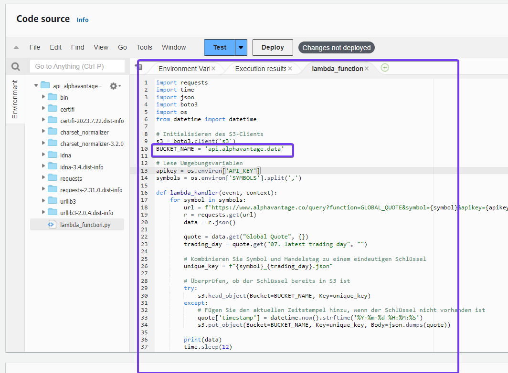

<br><br><br><br>

Before we run the code, we need to do some further configurations in AWS Lambda.
1. Go to **Configuration**
2. Click on **Environment variables**
3. Click on **Edit**
<br><br>
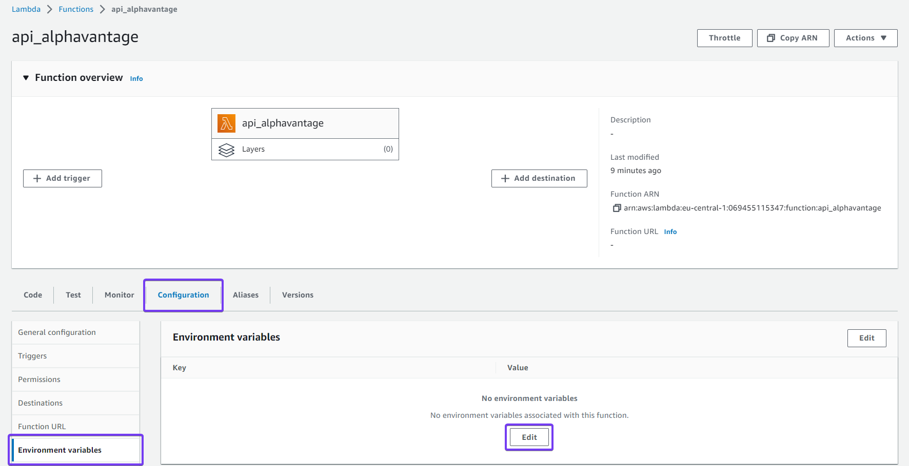

<br><br><br><br>

In our Python code we refer to these environment variables. Therefore, we now need to define them.
1. The first variable is your API key. For this, enter ```API_Key``` in the key name. Now enter your API Key from Alpha Vantage in Value. How to request that Key is described [here](../00-Alpha_Vantage/Alpha-Vantage_General-Information.md).
2. The second variable are your symbols. Enter in Key ```Symbols```. In the value field you can now enter all the symbols of the shares for which you want to have the data. How to determine the symbols of the respective shares is described under [Alpha-Vantage_Stock Selection](../00-Alpha_Vantage/Alpha-Vantage_Stock-Selection.md).
<br><br>
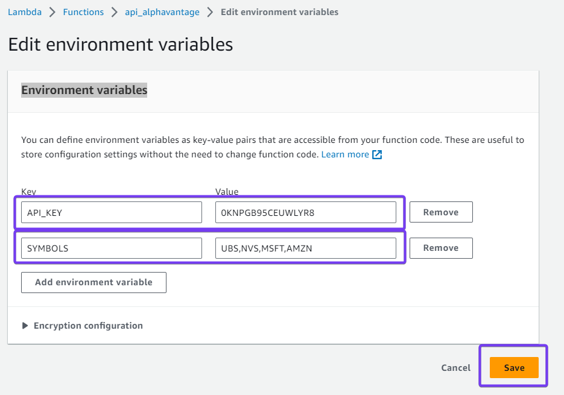

<br><br><br><br>

The second setting change we need to make is the timeout. Currently, the Lambda function is set to run for no longer than 3 seconds. We need to increase this time because we can retrieve data from Alpha Vantage from only 5 shares per minute. The Python code is therefore designed to retrieve a stock symbol only every 12 seconds. Therefore, the higher the number of stock symbols you query, the higher you have to set the timeout. To increase the time you have to proceed as follows:
1. Go to **Configuration**
2. Click on **General configuraiton**
3. **Edit**
<br><br>
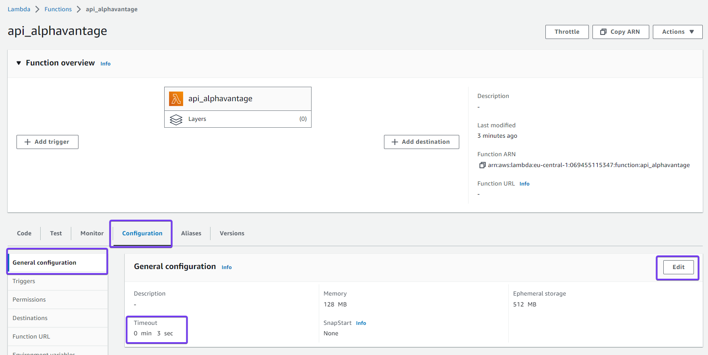

<br><br><br><br>

In this example, the timeout has now been increased to 3 minutes. Depending on the number of shares that are queried, a higher time must be selected.
1. Increase the **timeout** time
2. **Save**
<br><br>
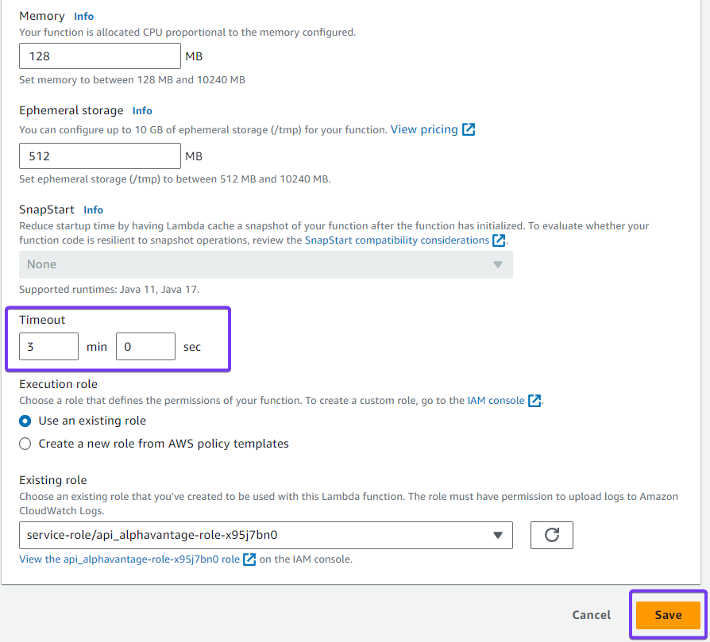

<br><br><br><br>

Now we have made all the configurations and can run and test the code. 
1. Click on **Deploy**. This saves the code.
2. Click on **Test**.
<br>
A new tab opens (*Execution results*). If the message **Data processig complete!** appears and you see the data of the shares you requested, everything has worked!
<br><br>
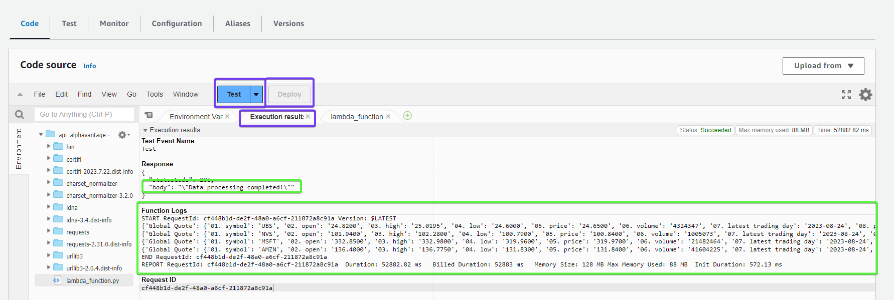
<br>
Please note that whenever you change your code, you must click **Deploy** to save your changes.

<br><br><br><br>

We now want to check whether the data has also been saved in the S3 bucket.
1. Go to Amazon S3
2. Click on Buckets
3. Select the bucket on which the data was written down according to the code in Lambda
<br><br>
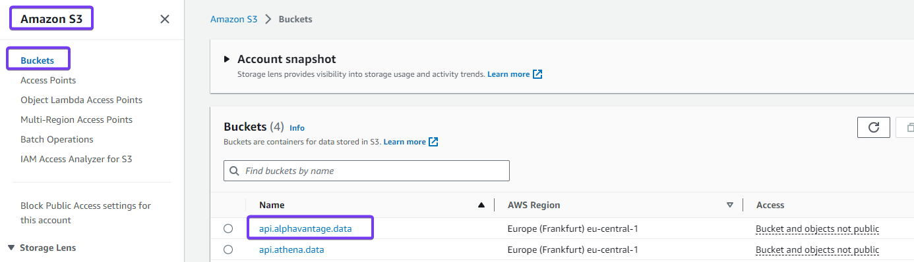

<br><br><br><br>

The files were loaded correctly into the bucket. It worked.
<br><br>
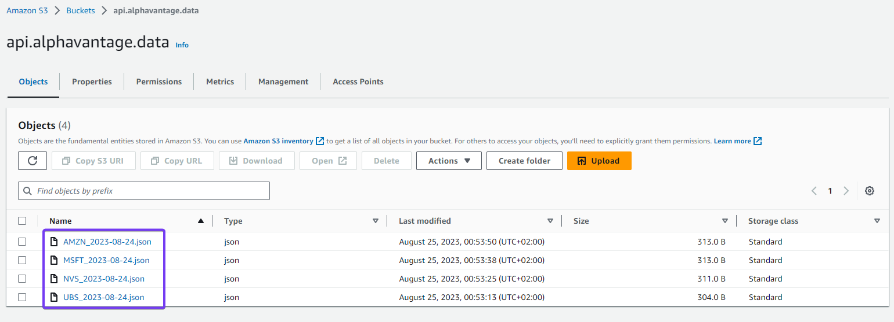

<br><br><br><br>
### Amazon EventBridge
<br><br>
We have now set up the Lambda funciton. The next step is to set up a rule on Amazon EventBridge so that the code is executed daily.
1. Enter ```Amazon EventBridge``` in the search box.
2. Select **EventBridge Rule**
3. **Create rule**
<br><br>
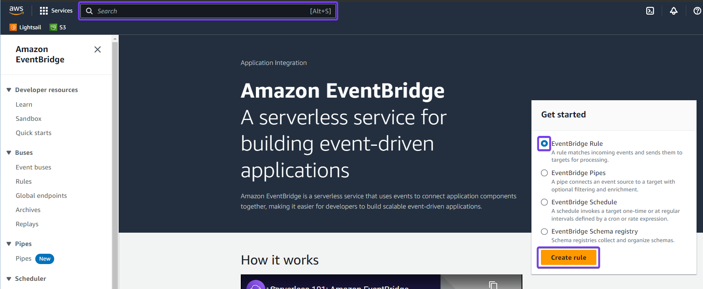

<br><br><br><br>

Now set up the rule as follows:
1. Name the rule
2. Write a description
3. Select **Schedule**
4. **Continue in EventBrdige Scheduler**
<br><br>
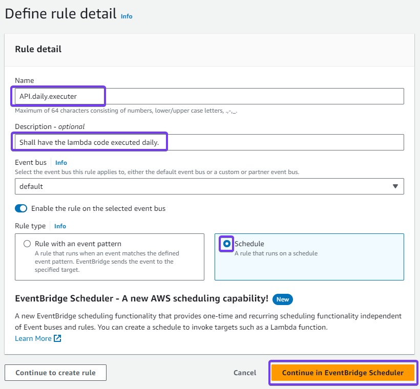

<br><br><br><br

We will now define the timetable:
1. Select **Recurring schedule**
2. As a schedule type we are using **Cron-based schedule**
3. We can enter our schedule in the cron expression. In this example, the event is triggered every day at 0530 am. This setting can be entered with ```cron(0 6 * * ? *)```. You can change this to suit your needs.
4. Select whether the event can be triggered in a flexible time window. Since I do not need the data exactly at 0530am, I have selected *15 minutes* there. 
<br><br>
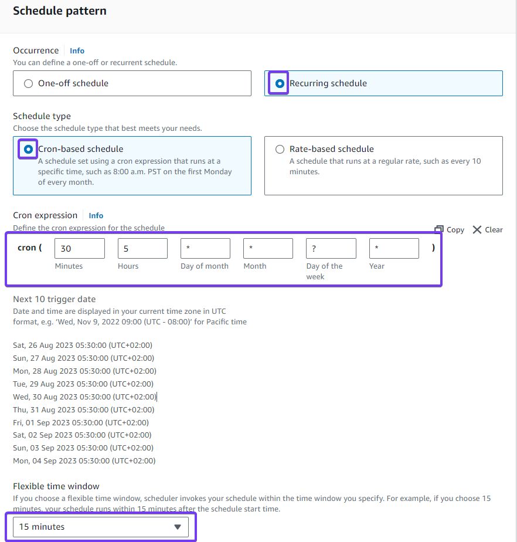

<br><br><br><br

The next part is to define the timeframe:
1. Select the start date (has to be in the future)
2. Select the end date (has to be after the start date)
<br><br>
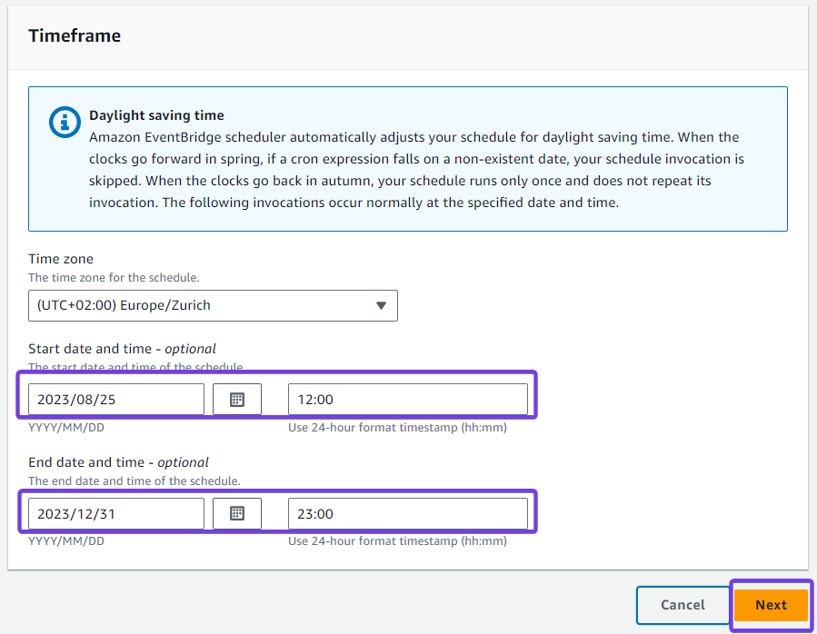

<br><br><br><br>

Now you will be asked to select a target:
1. **Templated targets**
2. Select **AWS Lambda**
3. **Next**
<br><br>


<br><br><br><br>

Now you will be asked to select a target:
1. **Templated targets**
2. Select **AWS Lambda**
3. **Next**
<br><br>
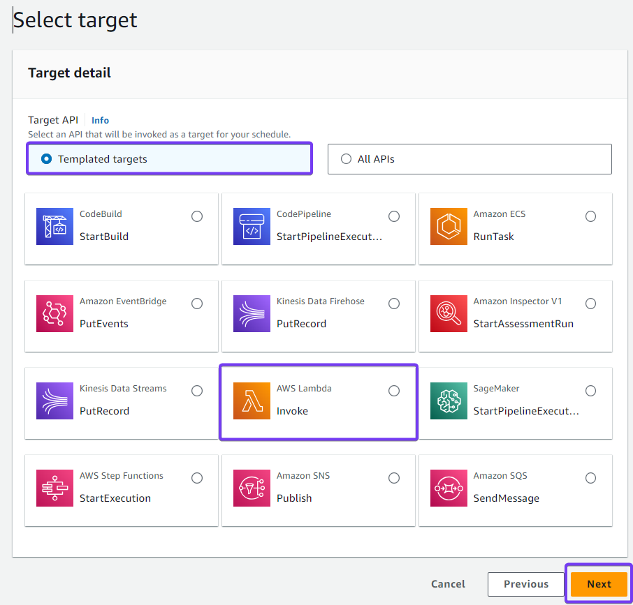

Select your Lambda function in the drop down menu. In this example its *api_alphavantage*. **Next**.
<br><br>
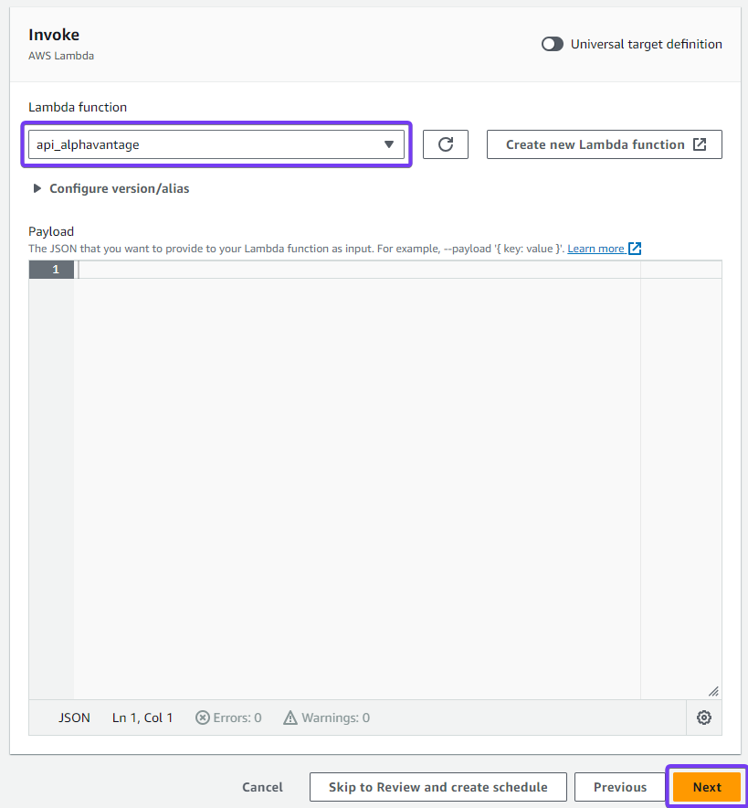

<br><br><br><br>

In the following selection you only have to decide what happens to your EventBridge Scheduler after it has finished (when the end date has been reached). In this example I want to keep it, so I selected *None*. The other items can be left as they are. 
<br><br>
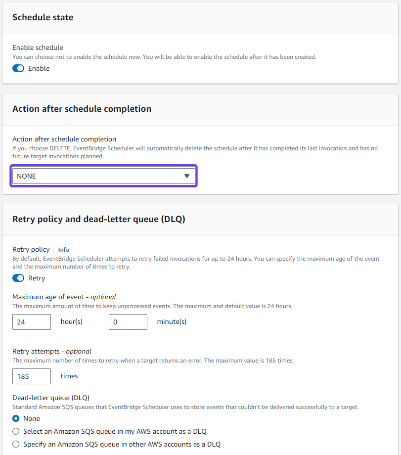

<br><br><br><br>

In order for the EventBridge Scheduler to access your Lambda function, it needs the appropriate authorisation in *IAM*. AWS creates this permission automatically.
1. Click **Create new role for this schedule**.
2. **Next**.
<br>
Finish setup and **Create schedule**.
<br><br>
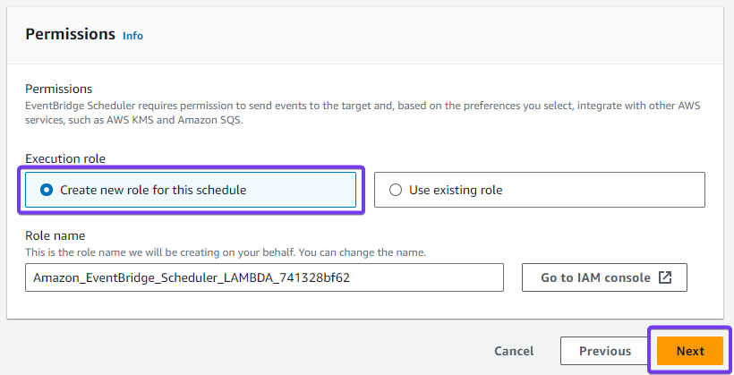

<br><br><br><br>

In order for the EventBridge Scheduler to access your Lambda function, it needs the appropriate authorisation in *IAM*. AWS creates this permission automatically.
1. Click **Create new role for this schedule**.
2. **Next**.
<br>
Finish setup and **Create schedule**.
<br><br>
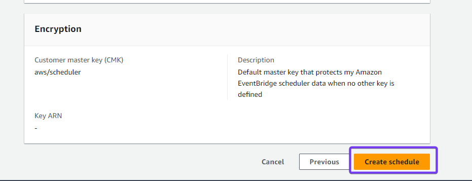

<br><br><br><br>

The set-up is now complete. In Amazon EventBridge under *Schedules* you can check your rule and change it if necessary. The data is now downloaded daily to your S3 bucket.
<br><br>


<br><br><br><br>

### AWS Athena
<br><br>
In the S3 bucket, a separate file is created for each record (there is one record per day for each share). Therefore, this structure cannot be used for analysis. We therefore need the Athena. This is an interactive query service that allows you to analyse data directly in Amazon S3. 
<br>
The data is stored in the S3 bucket as follows:
<br><br>
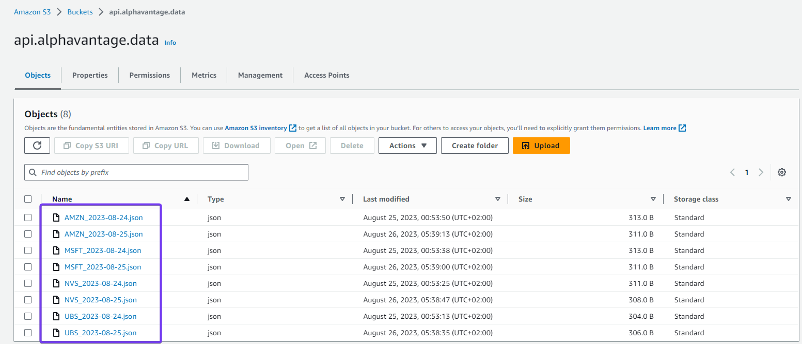

<br><br><br><br>

Before we do the setup in Athena, we need to give the application the appropriate permissions in *IAM* for the S3 buckets.
<br>
1. Go to your IAM console.
2. Open **Policies**.
3. **Create policy**. 
<br><br>
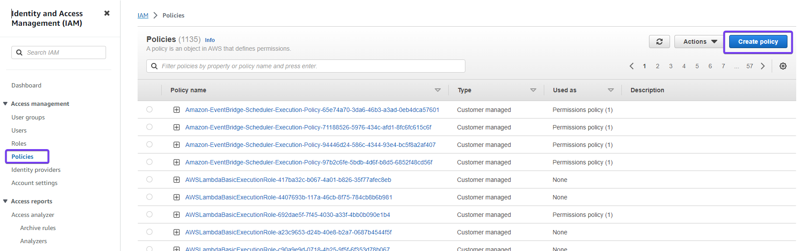

<br><br><br><br>

Secify permissions:
1. Go to **Json**
2. Delete default code
3. Enter the following code in the *policy editor*:
```
{
 "Version": "2012-10-17",
 "Statement": [
   {
     "Effect": "Allow",
     "Action": [
       "s3:GetObject",
       "s3:PutObject",
       "s3:ListBucket"
     ],
     "Resource": [
       "arn:aws:s3:::*",
       "arn:aws:s3:::*/*"
     ]
   }
 ]
}
```
4. **Next**
<br><br>
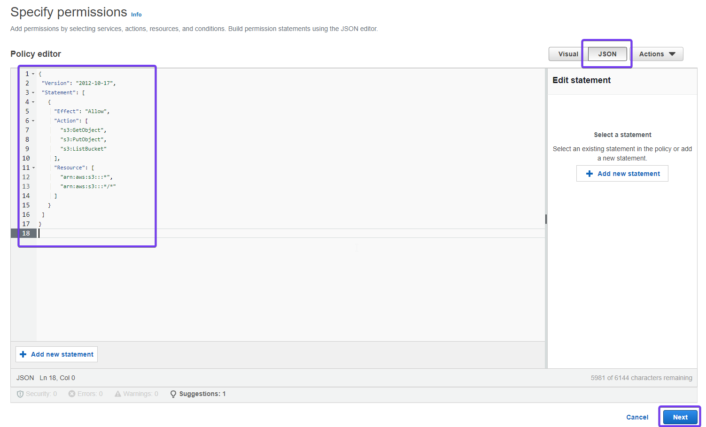

<br><br><br><br>

Review and create:
1. Name the policy ```Full_Access_S3_Athena```
2. At the bottom of the page - **Create policy**
<br><br>
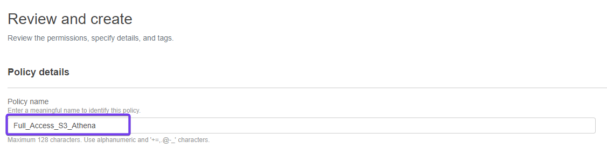

<br><br><br><br>

Go now back to your IAM console.
2. Open **Roles**.
3. **Create role**. 
<br><br>


<br><br><br><br>

Select trusted entity:
1. Choose **AWS Service**
2. Select the appliation **Glue**
3. Tick the newly appeared box **Glue**
4. **Next**
<br><br>
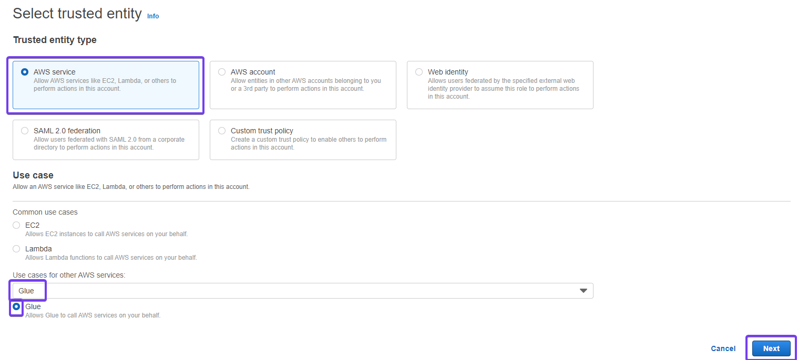

<br><br><br><br>

Add permission - select your newly created policy **Full_Access_S3_Athena**. At the bottom of the page - click **Next**. 
<br><br>
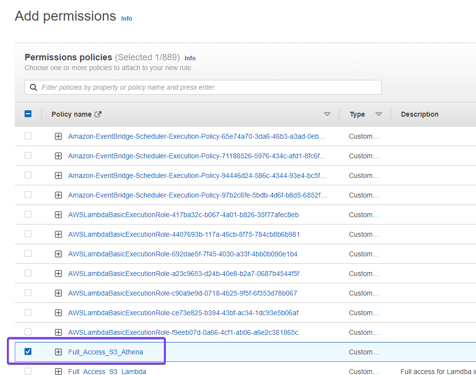

<br><br><br><br>

Name the role ```S3_Access_rights_Athena```. At the bottom of the page - click **Create role**. 
<br><br>
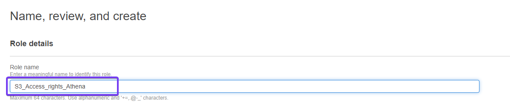

<br><br><br><br>

In *IAM* under *Roles* you see now the newly created role for Athena. 
<br><br>


<br><br><br><br>

Now that we have given permission, we can switch to the Athena application.
<br>
1. Enter ```Athena``` in the search field
2. **Lauchn query editor**
<br><br>
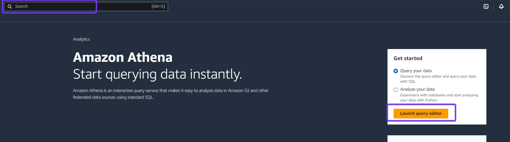

<br><br><br><br>

You are now in the *Query editor*. Before we retrieve the data, we have to make sure that the data is stored in the right place.
1. go to the **Settings**
2. Press **Manage**
<br><br>
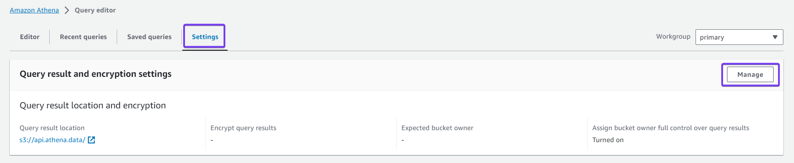

<br><br><br><br>

You are now in the *Query editor*. Before we retrieve the data, we have to make sure that the data is stored in the right place.
1. go to the **Settings**
2. Press **Manage**
<br><br>


<br><br><br><br>

Manage settings:
1. Press on **Browse S3**.
2. Select now the bucket in S3 where you want to store the result from Athena. We have opened a bucket in a earlier stage for this case. In this example the bucket is called *api.athena.data*
3. **Save** settings.
<br><br>
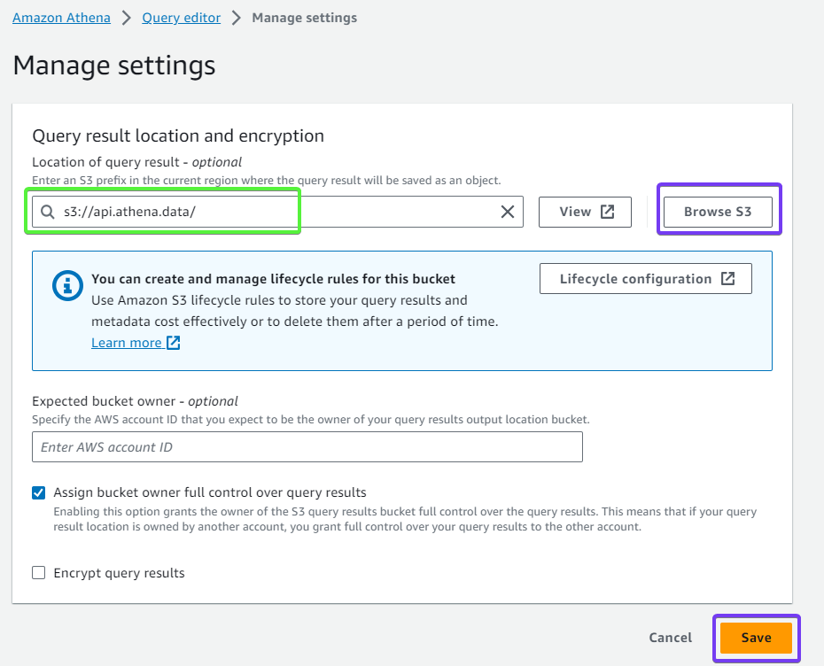

<br><br><br><br>

Go now in the *Query editor* to **Editor** and enter the following SQL code:
```
CREATE EXTERNAL TABLE IF NOT EXISTS stock_data (
    `01_symbol` string,
    `02_open` float,
    `03_high` float,
    `04_low` float,
    `05_price` float,
    `06_volume` bigint,
    `07_latest_trading_day` string,
    `08_previous_close` float,
    `09_change` float,
    `10_change_percent` string,
    `timestamp` string
)
ROW FORMAT SERDE 'org.openx.data.jsonserde.JsonSerDe'
WITH SERDEPROPERTIES ( 
  'mapping.01_symbol'='01. symbol',
  'mapping.02_open'='02. open',
  'mapping.03_high'='03. high',
  'mapping.04_low'='04. low',
  'mapping.05_price'='05. price',
  'mapping.06_volume'='06. volume',
  'mapping.07_latest_trading_day'='07. latest trading day',
  'mapping.08_previous_close'='08. previous close',
  'mapping.09_change'='09. change',
  'mapping.10_change_percent'='10. change percent'
)
LOCATION 's3://api.alphavantage.data/';
```
<br>
If your bucket has a different name than ```api.alphavantage.data```, you need to adjust the last line of code accordingly.
<br>
Press **Run** when you have entered the code. If everything has worked, it shows at the bottom under *Query results* that the code has been **Completed**. In addition, you will now see on the left side that a new table has been created.
<br><br>
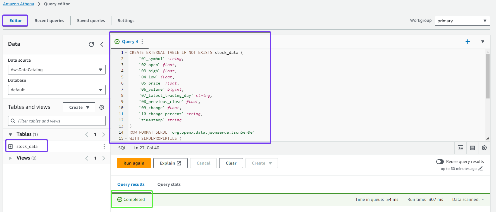

<br><br><br><br>

Do the following to save this code;
1. Press on the three dots next to your query name.
2. Name your query ```Create table```.
3. **Save query**
<br><br>
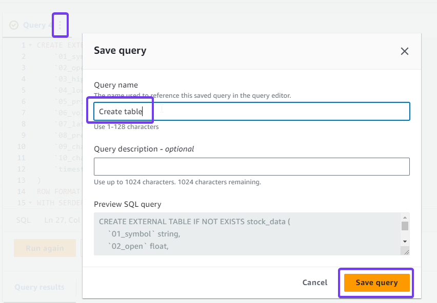

<br><br><br><br>

Now we can enter a new query to pull out the data;
1. Click on the **+**sign to open a new query
2. Enter the following code to pull out all the data:
   ```SELECT * FROM stock_data;```
3. At the bottom you now see the result
4. You can now copy the data in your csv file, excel etc.
<br><br>
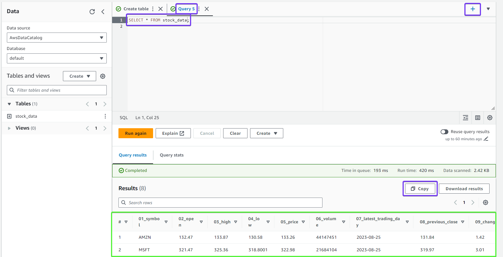
<br>
Safe this query and name it ```Download data```.

<br><br><br><br>

If you have new data in your S3 bucket, which you have from Alpha Vantage, you need to reload the table. If you want to delete the table completely first, you can proceed as follows:
1. Click again on the **+**sign to open a third query
2. Enter the following code to pull out all the data:
   ```SELECT * FROM stock_data;```
3. **Run** the code.
4. You will now see on the left side that there is no longer a table.
<br><br>
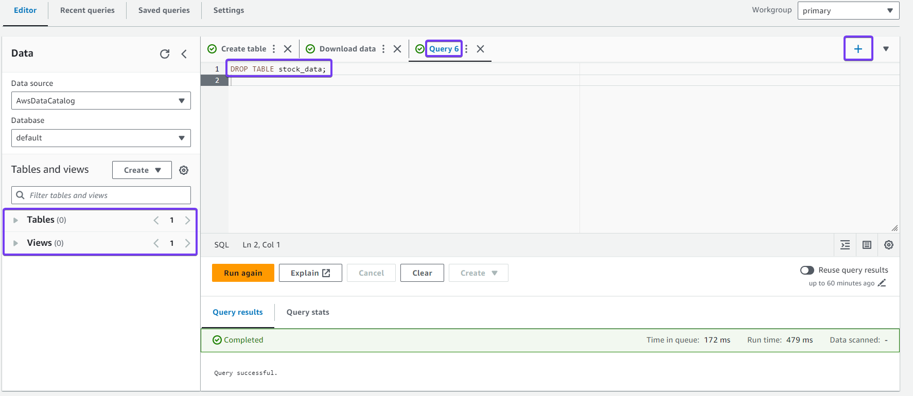
<br>
Safe this query and name it ```Delete table```.

<br><br><br><br>

The way we have set up Athena now, the data can be downloaded in a simple way. Depending on when the files are to be processed further in AWS, a different setup is needed in Athena. Possibly also a different database than *Athena*.

<br><br><br><br>

### AWS is now fully set up for our project.
<br><br>
Possible sources of error if something doesn't work often have to do with the permissions in *IAM*. If something doesn't work, take a look at these steps again. 

