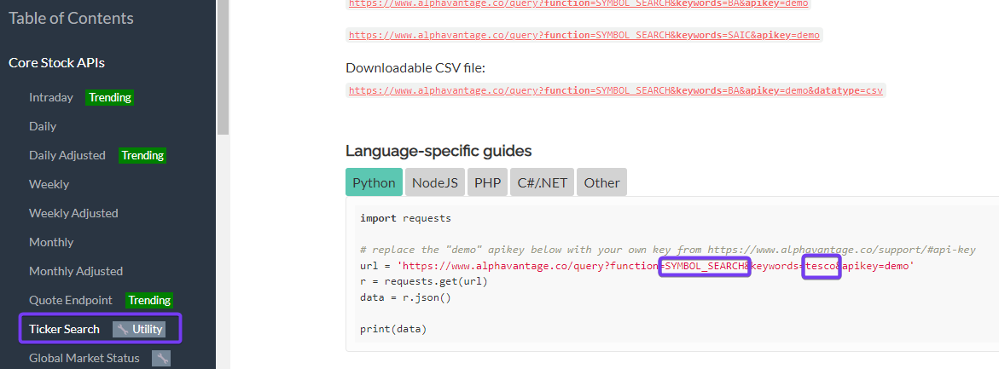
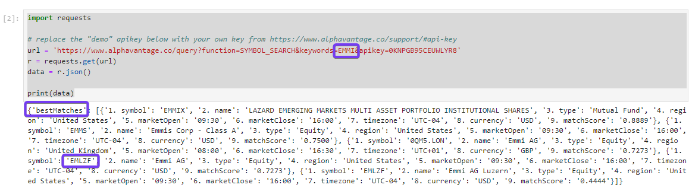

# How to select stock symbols
To download the data of a share, you need its symbol (e.g. MSFT for Microsoft). For US companies, the symbol in Alpha Vantage is identical to the symbol used on the stock exchange. For non-US companies, however, the symbol may differ. Therefore, the symbol must be searched for. Again, Alpha Vantage has written a [documentation](https://www.alphavantage.co/documentation/) on how to search for a symbol.



In this example, the symbol for Tesco is searched for.

## Download Python
In order to perform this search function, one of the following tools must be used: Python, NodeJS, PHP or C#/.Net. In this case we well use python.  

If you have not yet installed Python, you can do so. Please note that Python is purely the application and it is recommended to have an additional tool where the commands are entered (user interface). This [Youtube Video](https://www.youtube.com/watch?v=AuTkAWEa06E) shows you step-by-step how to install Python and the Jupyter Notebook.

## Search shares symbol
In this example we are looking for the correct symbol for the Emmi share. Enter the following code in your Jupyter notebook.

```
import requests

# replace the "demo" apikey below with your own key from https://www.alphavantage.co/support/#api-key
url = 'https://www.alphavantage.co/query?function=SYMBOL_SEARCH&keywords=EMMI&apikey=demo'
r = requests.get(url)
data = r.json()

print(data)
```

Note that you use your own API key instead of demo. How you can apply for an API key is explained [*here*](./Alpha Vantage/Alpa Vantage_Setup.md)
The "Best Matches" are now listed as a result. In this case, we will use the abbreviation "EMLZF" to query the API.



For Emmi we cannot download the data directly from the SIX stock exchange - for this you need a premium account with Alpha Vantage.

This can now be done for all shares from which you want to download data. 
